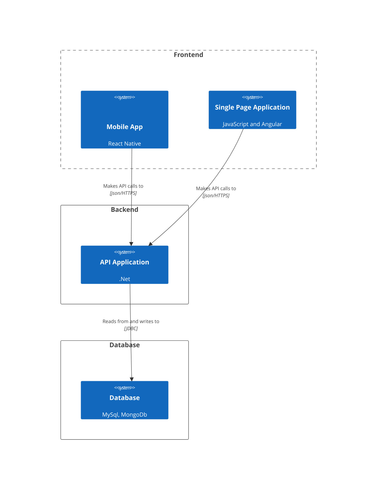
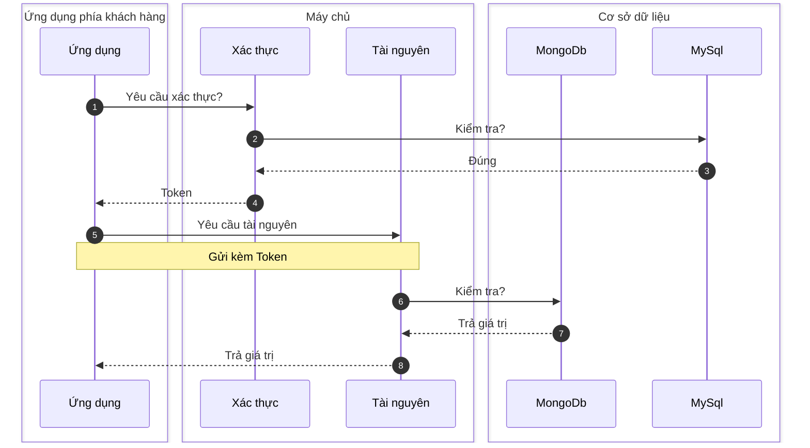

# Cấu trúc

## Cấu trúc ứng dụng
Ứng dụng được cấu trúc 3 lớp:

- Frontend
- Backend
- Database

## Lưu đồ

Dưới đây là phương thức giao tiếp tổng quan cho toàn bộ ứng dụng **FMEz**

:::tip Thông tin chung

Tất cả các ứng dụng sẽ đều giao tiếp với máy chủ theo phương thức RestfulAPI, một số trường hợp đặc biệt như đẩy thông báo sẽ dùng giao tiếp khác sẽ được đề cập qua từng ứng dụng cụ thể.

:::
