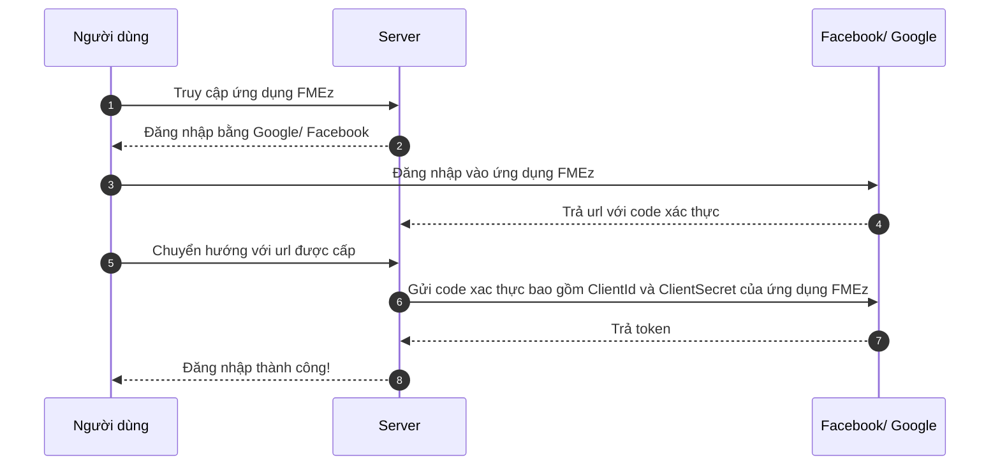

# Xác thực

## Hình thức

Xác thực trong ứng dụng gồm 3 hình thức:

- Đăng nhập với tài khoản đã đăng ký.
- Đăng nhập bằng tài khoản Google (xác thực 2 lớp: mật khẩu và điện thoại) tiêu chuẩn Oauth2.
- Đăng nhập bằng tài khoản Microsoft (xác thực 2 lớp: mật khẩu và điện thoại) tiêu chuẩn Oauth2.

## Tiêu chuẩn Oauth2



import Tabs from "@theme/Tabs";
import TabItem from "@theme/TabItem";

<Tabs>
<TabItem value="service" label="API Service">

```typescript title="/src/app/services/auth/auth.service.ts"
import { HttpClient, HttpHeaders } from '@angular/common/http';
import { Injectable, NgZone } from '@angular/core';
import { Router } from '@angular/router';
import { BehaviorSubject, catchError, firstValueFrom, Subject } from 'rxjs';
import { ConfigService } from '../config/config.service';
import { LocalStorageService } from '../local-storage/local-storage.service';
import { MessageService } from '../message/message.service';
import { BaseService } from '../base/base.service';
import { ApiResponse } from 'src/app/models/api/api-response.model';
import { LoadingService } from '../loading/loading-service';
import { MyAccountService } from '../my-account/my-account.service';
import { ForgotPasswordPostModel } from 'src/app/models/auth/forgot-password.post.model';
import { GlobalPermission } from 'src/app/models/auth/global-permission.model';
import { MicrosoftSignInPostModel } from 'src/app/models/auth/microsoft-signin.post.model';
import { ResetPasswordPostModel } from 'src/app/models/auth/reset-password.post.model';
import { TokenRequestModel } from 'src/app/models/auth/token.request.model';
import { TokenResponseModel } from 'src/app/models/auth/token.response.model';
import { User } from 'src/app/models/auth/user.model';
import { NotificationsService } from '../notification/notifications.service';
import { CacheManagerService } from '../cache-manager/cache-manager.service';
import { AuthGoogleSignInResponseModel } from 'src/app/models/auth/auth-google-response.model';

@Injectable({
    providedIn: 'root'
})
export class AuthService extends BaseService
{
    private userCacheKey: string = "cfc_fm_user_cache";
    constructor(
        private http: HttpClient
        , private configService: ConfigService
        , private localStorageService: LocalStorageService
        , private router: Router
        , private messageService: MessageService
        , private loadingService: LoadingService
        , private myAccountService: MyAccountService
        , private notificationsService: NotificationsService
        , private cacheManagerService: CacheManagerService
        , private ngZone: NgZone,
    )
    {
        super();
        //console.log("AuthService constructor");
        //this.loginFromCache();
    }

    private returnUrl: string = '';
    public setReturnUrl(returnUrl: string): void
    {
        this.returnUrl = returnUrl;
    }

    public user: User | null = null;
    private _bearerAccessToken: string = '';

    get bearerAccessToken(): string
    {
        return this._bearerAccessToken;
    }

    private _authStatus = new BehaviorSubject<boolean>(false);
    public authStatus$ = this._authStatus.asObservable();

    private _isAdmin = new BehaviorSubject<boolean>(false);
    public isAdmin$ = this._isAdmin.asObservable();

    public isAdmin(): boolean
    {
        return this.isAuthenticated() && this.user!.isAdmin;
    }

    private _globalPermission = new Subject<GlobalPermission>();
    public globalPermission$ = this._globalPermission.asObservable();

    public isAuthenticated(): boolean
    {
        return this.user != null && !this.user.expired() && !this.user.isBanned;
    }

    public login(): void
    {
        this.setReturnUrl(this.router.url);
        this.router.navigate(['account', 'login']);
    }

    public async loginFromServer(model: TokenRequestModel, notFromRefresh: boolean = true)
    {
        this.loadingService.show("logining", -1);
        const response = await firstValueFrom(this.http.post<ApiResponse<TokenResponseModel>>(`${this.configService.appConfig.ID_URL.API_URL}/v1/authentications/login-fm`, model));
        //console.log(response);
        this.loadingService.hide();
        if(response?.result)
        {
            await this.finishLogining(response.result, true, notFromRefresh);
        }
        else if(response?.errorMessage?.length > 1)
        {
            this.messageService.setErrorMessage(response.errorMessage);
        }
        else
        {
            this.messageService.setErrorMessage("Undefined error!");
        }
    }

    public async loginFromCache()
    {
        const userCache: TokenResponseModel = this.localStorageService.getObject<TokenResponseModel>(this.userCacheKey);
        if(!userCache)
        {
            this.localStorageService.remove(this.userCacheKey);
            return false;
        }
        else
        {
            userCache.expiresAt = new Date(userCache.expiresAt);
            if(userCache.expiresAt.getTime() > new Date().getTime())
            {
                return await this.finishLogining(userCache, false, true);
            }
            else
            {
                this.localStorageService.remove(this.userCacheKey);
                return false;
            }
        }
    }

    public async _loginFromCache(returnUrl: string = "")
    {
        const userCache: TokenResponseModel = this.localStorageService.getObject<TokenResponseModel>(this.userCacheKey);
        if(!userCache)
        {
            this.localStorageService.remove(this.userCacheKey);
            return false;
        }
        else
        {
            userCache.expiresAt = new Date(userCache.expiresAt);
            if(userCache.expiresAt.getTime() > new Date().getTime())
            {
                return await this._finishLogining(userCache, false, returnUrl);
            }
            else
            {
                this.localStorageService.remove(this.userCacheKey);
                return false;
            }
        }
    }

    private async finishLogining(resModel: TokenResponseModel, isSavedToLocalStorage: boolean = false, isRedirect: boolean = true)
    {
        //console.log("finishLogining");
        this.user = new User(resModel);
        this._bearerAccessToken = "Bearer " + resModel.accessToken;
        this._authStatus.next(true);
        this._isAdmin.next(this.isAdmin());

        const time = new Date(resModel.expiresAt).getTime() - new Date().getTime();
        //console.log("finishLogining: " + time);
        setTimeout(() => {
           this.refreshToken(resModel.refreshToken, false);
        }, time);

        if(isSavedToLocalStorage)
        {
            this.localStorageService.setObject(this.userCacheKey, resModel);
        }

        if(this.isAuthenticated())
        {
            this.notificationsService.startConnection(this.user.accessToken)
            // if(await this.notificationsService.startConnection(this.user.accessToken))
            // {
            //     this.notificationsService.gets();
            // }

            await this.myAccountService.getMyProfile(this.user);

            if(isRedirect)
            {
                if(this.returnUrl?.length > 0 && !this.returnUrl.includes("/account/login"))
                {
                    this.router.navigateByUrl(this.returnUrl);
                    this.setReturnUrl("");
                }
                else
                {
                    this.router.navigate(['']);
                }
            }

            return true;
        }
        else
        {
            this.router.navigate(['account', 'login']);
            return false;
        }
    }

    private async _finishLogining(resModel: TokenResponseModel, isSavedToLocalStorage: boolean = false, returnUrl: string = "")
    {
        //console.log("finishLogining");
        this.user = new User(resModel);
        this._bearerAccessToken = "Bearer " + resModel.accessToken;
        this._authStatus.next(true);
        this._isAdmin.next(this.isAdmin());

        const time = new Date(resModel.expiresAt).getTime() - new Date().getTime();
        //console.log("finishLogining: " + time);
        setTimeout(() => {
           this.refreshToken(resModel.refreshToken, false);
        }, time);

        if(isSavedToLocalStorage)
        {
            this.localStorageService.setObject(this.userCacheKey, resModel);
        }

        if(this.isAuthenticated())
        {
            this.notificationsService.startConnection(this.user.accessToken)
            // if(await this.notificationsService.startConnection(this.user.accessToken))
            // {
            //     this.notificationsService.gets();
            // }

            await this.myAccountService.getMyProfile(this.user);

            if(returnUrl && returnUrl.length > 0)
            {
                this.router.navigateByUrl(returnUrl);
            }
            // else
            // {
            //     this.router.navigate(['']);
            // }

            return true;
        }
        else
        {
            this.router.navigate(['account', 'login']);
            return false;
        }
    }

    /**Log out and reload page
     * timeOut: log out after seconds.
     */
    private logOut(timeOut: number = -1): void
    {
        this._authStatus.next(false);
        this.localStorageService.remove(this.userCacheKey);
        this.cacheManagerService.clearLocalCacheWithNameStartsWith("/api/");
        this.user = null;
        this._bearerAccessToken = '';
        this._isAdmin.next(false);
        //this.projectService.clearCache();
        setTimeout(() => {
            this.router.navigate(['account', 'login']);
        }, timeOut > 0 ? timeOut * 1000 : 0);
    }

    public async logOutFromServer(timeOut: number = -1)
    {
        this.loadingService.show("..logging out...");
        const response = await firstValueFrom(this.http.post<ApiResponse<boolean>>(`${this.configService.appConfig.ID_URL.API_URL}/v1/my-accounts/logout-fm`, null, {
            headers: new HttpHeaders({
                'Content-Type':  'application/json',
                'Authorization': this.bearerAccessToken,
            })
        }));
        this.loadingService.hide();
        this.logOut(timeOut);

        return response?.result;
    }

    private async refreshToken(rfToken: string, isRedirect: boolean)
    {
        this.localStorageService.remove(this.userCacheKey);
        this._bearerAccessToken = "";
        this._isAdmin.next(false);
        this._authStatus.next(false);
        this.user = null;

        const model = new TokenRequestModel();
        model.grantType = "refresh_token";
        model.refreshToken = rfToken;

        try
        {
            this.loadingService.show("retriving permissions");
            const response = await firstValueFrom(this.http.post<ApiResponse<TokenResponseModel>>(`${this.configService.appConfig.ID_URL.API_URL}/v1/authentications/fm-refresh-token`, model));
            this.loadingService.hide();
            if(response?.result)
            {
                return this.finishLogining(response.result, true, isRedirect);
            }
            else
            {
                this.messageService.setErrorMessage(response.errorMessage);
                return false;
            }
        }
        catch(err)
        {
            this.loadingService.hide();
            console.error(err);
            this.messageService.setErrorMessage("Error: Refresh the page to login again.");
            return false;
        }
    }


    //#region Forgot Password
    public async forgotPassword(model: ForgotPasswordPostModel)
    {
        const response = await firstValueFrom(this.http.post<ApiResponse<boolean>>(`${this.configService.appConfig.ID_URL.API_URL}/v1/authentications/forgot-password`, model));
        if(response?.result)
        {
            this.messageService.setMessage(response?.errorMessage, -1);
            return true;
        }

        return false;
    }
    //#endregion

    //#region Reset Password
    public async resetPassword(model: ResetPasswordPostModel)
    {
        this.messageService.clearMessage();
        const response = await firstValueFrom(this.http.post<ApiResponse<boolean>>(`${this.configService.appConfig.ID_URL.API_URL}/v1/authentications/reset-password`, model));

        if(response.result)
        {
            this.messageService.setMessage(response?.errorMessage);
            return true;
        }
        else return false;
    }
    //#endregion

    //#region Navigation
    public goToRegisterPage(): void
    {
        this.router.navigate(['account', 'register']);
    }
    public goToLoginPage(): void
    {
        this.router.navigate(['account', 'login']);
    }
    public goToMyAccount(): void
    {
        this.router.navigate(['my-account']);
    }
    //#endregion

    //#region Call Back
    public async completeMicrosoftSignIn(
        code: string,
        email: string,
        returnUrl: string = "")
    {
        //console.log("completeMicrosoftSignIn");
        try
        {
            this.loadingService.show("signing in");
            const model = new MicrosoftSignInPostModel(code, email);
            const response = await firstValueFrom(this.http.post<ApiResponse<TokenResponseModel>>(`${this.configService.appConfig.ID_URL.API_URL}/v1/authentications/microsoft-signin-fm`, model)
            .pipe(catchError(this.handleError)));
            this.loadingService.hide();
            if(response?.result)
            {
                this.loadingService.show();
                await this._finishLogining(response.result, true, returnUrl);
                this.loadingService.hide();
                return true;
            }
            else
            {
                this.messageService.setErrorMessage(response.errorMessage);
                return false;
            }
        }
        catch(err) {
            this.loadingService.hide();
            console.error(err);
            return false;
        }
    }
    //#endregion

    //#region Google
    public initLoginViaGoogleFunction(returnUrl: string = "")
    {
        //console.log("initLoginViaGoogleFunction");
        (globalThis as any).loginViaGoogle = (user: AuthGoogleSignInResponseModel) => this.ngZone.run(() => {
            this._loginViaGoogle(user, returnUrl)
        });
    }

    private async _loginViaGoogle(model: AuthGoogleSignInResponseModel, returnUrl: string = "")
    {
        //console.log(model);
        //console.log(returnUrl);
        try
        {
            this.loadingService.show();
            const response = await firstValueFrom(this.http.post<ApiResponse<TokenResponseModel>>(`[idApi]/v1/authentications/google/fm`, model,
            {
                headers: new HttpHeaders({
                    'Content-Type': 'application/json'
                })
            })
            .pipe(
                catchError(this.handleError)
            ));

            this.loadingService.hide();
            if(response && response.result)
            {
                this.messageService.setMessage("Login successfully");
                await this._finishLogining(response.result, true, returnUrl);
                return true;
            }
            else
            {
                switch(response.errorMessage)
                {
                    case "admincreatefirst":
                        this.messageService.setErrorMessage("The system administrator must create your account before. Contact: luvo@cofico.com.vn.");
                        break;
                    case "userinfonotfound":
                        this.messageService.setErrorMessage("Can not find your account. Contact: luvo@cofico.com.vn.");
                        break;
                    case "denyaccess":
                        this.messageService.setErrorMessage("You are banned. Contact: luvo@cofico.com.vn.");
                        break;
                    case "newtokenfailed":
                        this.messageService.setErrorMessage("Can not login. Contact: luvo@cofico.com.vn.");
                        break;
                    default:
                        this.messageService.setErrorMessage("Undefined error. Contact: luvo@cofico.com.vn!");
                        break;
                }
                return false;
            }
        }
        catch(err)
        {
            this.loadingService.hide();
            console.error(err);
            this.messageService.setErrorMessage("Undefined error");
            return false;
        }
    }
    //#endregion

}

```

</TabItem>

<TabItem value="html" label="Html">

```html title="/src/app/components/login/login.component.html"
<div id="login" *ngIf="!isLoggedIn">
    <div class="content">
        <div class="body">
            <form class="width-100pc" [formGroup]="form">
                <mat-form-field class="width-100pc" color="accent">
                    <mat-label>Email</mat-label>
                    <input matInput autocomplete="current-email" placeholder="Email" formControlName="userName" required>
                    <mat-icon matSuffix>alternate_email</mat-icon>
                    <mat-error *ngIf="form.controls['userName'].invalid">Required!</mat-error>
                </mat-form-field>
                <mat-form-field class="width-100pc" color="accent">
                    <mat-label>Password</mat-label>
                    <input autocomplete="current-password" matInput type="password" placeholder="Password" formControlName="password">
                    <mat-icon matSuffix>password</mat-icon>
                    <mat-error *ngIf="form.controls['password'].invalid">Required!</mat-error>
                </mat-form-field>
            </form>
            <div class="buttons">
                <button [disabled]="form.invalid" mat-raised-button color="primary" (click)="login()">Login</button>
                <!-- <button mat-raised-button color="basic" (click)="authService.goToRegisterPage()">REGISTER</button> -->
            </div>
            <div class="text-align-center mr-top-1rem"><a [routerLink]="['/account/forgot-password']">Forgot Password?</a></div>
            <div class="display-flex align-items-center justify-content-center">
                <div (click)="loginViaMicrosoft();" title="Login via Microsoft @cofico.com.vn account" class="microsoft border-solid-global cursor-pointer hover-background-color background">
                    <svg style="width:24px;height:24px" viewBox="0 0 24 24">
                        <path fill="currentColor" d="M2,3H11V12H2V3M11,22H2V13H11V22M21,3V12H12V3H21M21,22H12V13H21V22Z" />
                    </svg>
                </div>
                <div class="mr-left-0p5rem">
                    <div id="g_id_onload"
                        data-client_id="1023183007122-apfeit5lti2m8slhvrcun19a1tdedspt.apps.googleusercontent.com"
                        data-context="signin"
                        data-ux_mode="popup"
                        data-callback="loginViaGoogle"
                        data-nonce=""
                        data-auto_prompt="false">
                    </div>

                    <div class="g_id_signin"
                        data-type="icon"
                        data-shape="circle"
                        data-theme="outline"
                        data-text="signin_with"
                        data-size="large">
                    </div>
                </div>
            </div>


        </div>
    </div>
</div>

```

</TabItem>

<TabItem value="scss" label="Scss">

```scss title="/src/app/components/login/login.component.scss"
#login
{
    display: flex;
    flex-direction: column;
    justify-content: center;
    align-items: center;
    padding: 1rem;
    margin: auto;
    height: 100%;
    .content
    {
        @media only screen and (min-width: 576px)
        {
            width: 350px;
        }
        @media only screen and (min-width: 1200px)
        {
            width: 500px;
        }

        .body
        {
            padding: 1rem;
            border: solid 1px;
            border-radius: 1rem;
        }

        .microsoft
        {
            //box-shadow: 0 2px 2px 0 rgb(0 0 0 / 14%), 0 3px 1px -2px rgb(0 0 0 / 20%), 0 1px 5px 0 rgb(0 0 0 / 12%);
            border-radius: 20px;
            width: 40px;
            height: 40px;
            display: flex;
            align-items: center;
            justify-content: center;
        }
    }
}

```

</TabItem>

<TabItem value="typescript" label="Typescript">

```typescript title="/src/app/components/login/login.component.ts"
import { NgIf } from '@angular/common';
import { Component, OnInit } from '@angular/core';
import { FormControl, FormGroup, ReactiveFormsModule, Validators } from '@angular/forms';
import { MatButtonModule } from '@angular/material/button';
import { MatFormFieldModule } from '@angular/material/form-field';
import { MatIconModule } from '@angular/material/icon';
import { MatInputModule } from '@angular/material/input';
import { ActivatedRoute, RouterLink } from '@angular/router';
import { TokenRequestModel } from 'src/app/models/auth/token.request.model';
import { AuthService } from 'src/app/services/auth/auth.service';
import { ConfigService } from 'src/app/services/config/config.service';
import { PageService } from 'src/app/services/page/page-service';

@Component({
    standalone: true,
    imports: [
        NgIf,

        RouterLink,
        MatInputModule, MatFormFieldModule,
        MatIconModule, MatButtonModule, ReactiveFormsModule,
    ],
    selector: 'app-login',
    templateUrl: './login.component.html',
    styleUrls: ['./login.component.scss']
})
export class LoginComponent implements OnInit {

    constructor(
        public authService: AuthService
        , private pageService: PageService
        , public configService: ConfigService
        , private route: ActivatedRoute
    )
    {
        this.pageService.setPageTitle("ACCOUNT: LOGIN");
    }

    public isLoggedIn: boolean = true;

    private _returnUrl: string = "";
    async ngOnInit()
    {
        const returnUrl = this.route.snapshot.queryParamMap.get('returnUrl');
        if(returnUrl && returnUrl.length > 0)
        {
            this._returnUrl = returnUrl;
        }
        this.isLoggedIn = await this.authService._loginFromCache(this._returnUrl);
        if(!this.isLoggedIn)
        {
            this.authService.initLoginViaGoogleFunction(this._returnUrl);
            await this.pageService.loadGoogleIdJs();
        }
    }

    //#region Form
    public form = new FormGroup({
        userName: new FormControl<string>('', [Validators.required, Validators.email]),
        password: new FormControl<string>('', [Validators.required]),
    });
    //#endregion

    //#region Login
    public async login()
    {
        //this.messageService.setMessage("... Logining ...");
        //console.log(this.loginModel);
        const loginModel = new TokenRequestModel();
        loginModel.grantType = "password";
        loginModel.userName = this.form.value.userName ? this.form.value.userName : "";
        loginModel.password = this.form.value.password ? this.form.value.password : "";

        await this.authService.loginFromServer(loginModel);
        // this.recaptchaV3Service.execute('login').toPromise().then(token => {
        //     this.loginModel.token = token;
        //     this.authService.loginFromServer(this.loginModel,
        //         () => {
        //             this.messageService.setMessage("Logged in successfully!");
        //             this.spinner.hide("login-loading", 555);
        //         },
        //         (err: string) =>
        //         {
        //             this.messageService.setErrorMessage(err, 5555);
        //             this.spinner.hide("login-loading", 555);
        //         }
        //     );
        // })
        // .catch(
        //     err => {
        //         console.error(err);
        //         this.messageService.setErrorMessage("Can not validate! Please try again!", -1);
        //     }
        // );

    }
    //#endregion

    public loginViaMicrosoft()
    {
        document.location.href = `${this.configService.appConfig.ID_URL.URL}/external/microsoft-signin-fm?returnUrl=${this._returnUrl}`;
    }

}

```

</TabItem>

</Tabs>
