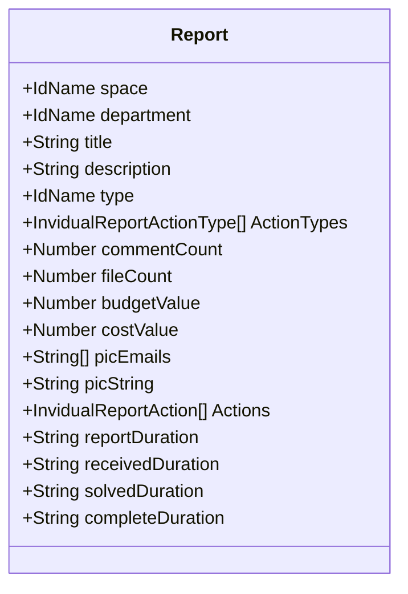
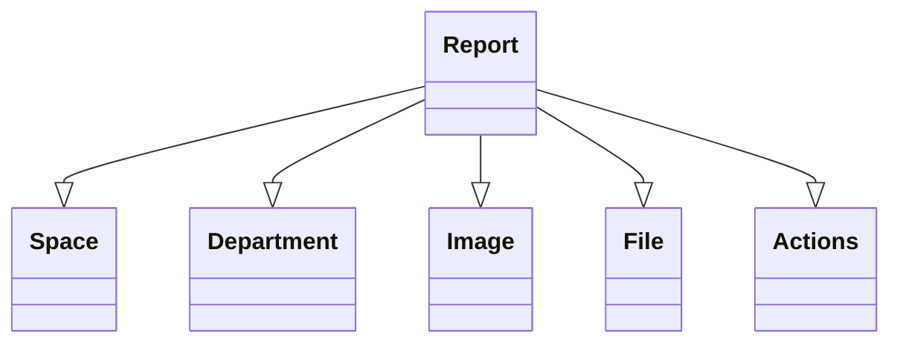

# Báo lỗi

import Tabs from "@theme/Tabs";
import TabItem from "@theme/TabItem";

## Mô hình dữ liệu


## Mối quan hệ với các mô hình khác



<Tabs>
<TabItem value="service" label="API Service">

```typescript title="/src/app/services/invidual-report-v2/invidual-report-v2.service.ts"
import { HttpClient, HttpHeaders } from "@angular/common/http";
import { Injectable } from "@angular/core";
import { catchError, firstValueFrom } from "rxjs";
import { ApiResponse } from "src/app/models/api/api-response.model";
import { BaseService } from "../base/base.service";
import { ConfigService } from "../config/config.service";
import { LoadingService } from "../loading/loading-service";
import { MessageService } from "../message/message.service";
import { CacheManagerService } from "../cache-manager/cache-manager.service";
import { InvidualReport_v2_PostModel } from "src/app/models/invidual_report_v2/invidual-report-v2.post.model";
import { InvidualReportResponseModel_v2, InvidualReport_v2 } from "src/app/models/invidual_report_v2/invidual_report_v2.model";
import { InvidualReportImage_v2_PostModel } from "src/app/models/invidual_report_v2/invidual_report_v2-image.post.model";
import { ImageResponseModel } from "src/app/models/image/image.response.model";
import { Image } from "src/app/models/image/image.model";
import { InvidualReportStatus } from "src/app/models/invidual_report_v2/invidual_report_status.enum";
import { TimeService } from "../time/time.service";
import { PaginationResponseModel } from "src/app/models/pagination/pagination.response.model";
import { PaginationData } from "src/app/models/pagination/pagination-data.model";
import { InvidualReportActionPostModel } from "src/app/models/invidual_report_v2/invidual-report-action.post.model";
import { InvidualReportAction, InvidualReportActionResponseModel } from "src/app/models/invidual_report_v2/invidual-report-action.model";
import { FileResponseModel } from "src/app/models/file/file.response.model";
import { FileModel } from "src/app/models/file/file.model";
import { FilesService } from "../file/files.service";
import { InvidualReport_v2_ExportPostModel } from "src/app/models/invidual_report_v2/invidual-report-v2-export.post.model";
import { InvidualReportStat_v2_SerializedModel } from "src/app/models/invidual_report_v2/invidual-report-stat-v2.serialized.model";
import { InvidualReportStatIndices_v2_SerializedModel } from "src/app/models/invidual_report_v2/invidual-report-stat-indices-v2.serialized.model";
import { InvidualReportStatPIC_v2_SerializedModel } from "src/app/models/invidual_report_v2/invidual-report-stat-pic-v2.serialized.model";
import { InvidualReport_v2_PutModel } from "src/app/models/invidual_report_v2/invidual-report-v2.put.model";

@Injectable()
export class InvidualReport_v2_Service extends BaseService {

    constructor(
        private http: HttpClient
        , private messageService: MessageService
        , private loadingService: LoadingService
        , private configService: ConfigService
        , private cacheManagerService: CacheManagerService
        , private timeService: TimeService
        , private filesService: FilesService
    )
    {
        super();
        this.baseAddress = `[fmApi]/v2/[clientId]/[projectId]/invidual-reports`;
        this.baseCMAddress = `[cmApi]/v1/images/invidual-reports`;

    }

    private baseAddress: string;
    private baseCMAddress: string;
    private httpOptions = {
        headers: new HttpHeaders({
            'Content-Type': 'application/json'
        })
    };

    private _clearLocalCache(route: string = "")
    {
        if(route && route.length > 0)
        {
            this.cacheManagerService.clearLocalCacheWithNameIncluding(["/api/", "/v2/", "/invidual-reports", route]);
        }
        else
        {
            this.cacheManagerService.clearLocalCacheWithNameIncluding(["/api/", "/v2/", "/invidual-reports"]);
        }
    }

    private _clearSingleLocalCache(reportId: string)
    {
        if(reportId && reportId.length > 0)
        {
            this.cacheManagerService.clearLocalCacheWithNameIncluding(["/api/", "/v2/", "/invidual-reports", "single-" + reportId]);
        }
    }

    private _clearFileLocalCache(reportId: string)
    {
        if(reportId && reportId.length > 0)
        {
            this.cacheManagerService.clearLocalCacheWithNameIncluding(["/api/", "/v2/", "/invidual-reports", "files-" + reportId]);
        }
    }

    private _clearLocalActionCache(reportId: string = "")
    {
        if(reportId && reportId.length > 0)
        {
            this.cacheManagerService.clearLocalCacheWithNameIncluding(["/api/", "/v2/", "/invidual-report-actions", "/host-" + reportId]);
        }
        else
        {
            this.cacheManagerService.clearLocalCacheWithNameIncluding(["/api/", "/v2/", "/invidual-report-actions"]);
        }
    }

    public async gets(
        spaceId: string, text: string,
        statuses: InvidualReportStatus[], types: string[],
        from: number, to: number,
        pageIndex: number, forceNew: boolean = false, loadingDivId: string = "")
    {
        try
        {
            this.loadingService.show("", -1, loadingDivId);
            if(!text || text.length < 3) text = "";
            if(statuses && statuses.length > 0) statuses = statuses.sort((a, b) => a - b);
            const status: string = statuses && statuses.length > 0 ? Object.values(statuses).join(",") : "";
            const type: string = types && types.length > 0 ? types.sort((a, b) => a > b ? -1 : 1).join(",") : "";

            if(from > 0)
            {
                from = this.timeService.roundMinutes(from, 10);
            }

            if(to > 0)
            {
                if(to > new Date().getTime()) to = new Date().getTime();
                to = this.timeService.roundMinutes(to, 10);
            }

            const response = await firstValueFrom(this.http.get<ApiResponse<PaginationResponseModel<InvidualReportResponseModel_v2>>>(`${this.baseAddress}?from=${from}&page=${pageIndex}&spaceId=${spaceId}&status=${status}&text=${text}&to=${to}&type=${type}`,
                this.cacheManagerService.getLocalCacheHttpOptions(this.httpOptions.headers, 24 * 60, forceNew)
            )
            .pipe(
                catchError(this.handleError)
            ));

            this.loadingService.hide(loadingDivId);

            if(response && response.result)
            {
                const items = response.result.items.map(x => new InvidualReport_v2(x));
                return new PaginationData(items, response.result.total);
            }
            else
            {
                this.messageService.setErrorMessage(response.errorMessage);
                return false;
            }
        }
        catch(err)
        {
            this.loadingService.hide(loadingDivId);
            console.error(err);
            this.messageService.setErrorMessage("Error: Can not connect to the server!");
            return false;
        }
    }

    public async post(
        model: InvidualReport_v2_PostModel,
        loadingDivId: string = ""
    )
    {
        try
        {
            this.loadingService.show("", -1, loadingDivId);
            const response = await firstValueFrom(this.http.post<ApiResponse<InvidualReportResponseModel_v2>>(`${this.baseAddress}`, model, this.httpOptions)
            .pipe(
                catchError(this.handleError)
            ));
            this.loadingService.hide(loadingDivId);

            if(response.result)
            {
                this._clearLocalCache();
                this.messageService.setMessage("Successfully");
                const item = new InvidualReport_v2(response.result);
                return item;
            }
            else
            {
                this.messageService.setErrorMessage(response.errorMessage);
                return false;
            }
        }
        catch(err)
        {
            this.loadingService.hide(loadingDivId);
            console.error(err);
            this.messageService.setErrorMessage("Error: Can not connect to the server!");
            return false;
        }
    }

    public async put(
        model: InvidualReport_v2_PutModel,
        loadingDivId: string = ""
    )
    {
        try
        {
            this.loadingService.show("", -1, loadingDivId);
            const response = await firstValueFrom(this.http.put<ApiResponse<InvidualReportResponseModel_v2>>(`${this.baseAddress}`, model, this.httpOptions)
            .pipe(
                catchError(this.handleError)
            ));
            this.loadingService.hide(loadingDivId);

            if(response.result)
            {
                this._clearLocalCache();
                this.messageService.setMessage("successfully");
                const item = new InvidualReport_v2(response.result);
                return item;
            }
            else
            {
                this.messageService.setErrorMessage(response.errorMessage);
                return false;
            }
        }
        catch(err)
        {
            this.loadingService.hide(loadingDivId);
            console.error(err);
            this.messageService.setErrorMessage("Error: Can not connect to the server!");
            return false;
        }
    }

    public async postReportImages(
        model: InvidualReportImage_v2_PostModel,
        loadingDivId: string = ""
    )
    {
        this.messageService.clearMessage();

        try
        {
            this.loadingService.show("", -1, loadingDivId);
            const response = await firstValueFrom(this.http.post<ApiResponse<ImageResponseModel[]>>(`${this.baseCMAddress}/invidual-reports`, model, this.httpOptions)
            .pipe(
                catchError(this.handleError)
            ));
            this.loadingService.hide(loadingDivId);

            if(response?.result)
            {
                this.messageService.setMessage("Uploaded images: " + response.result.length);
                const items = response.result.map(x => new Image(x, this.configService.appConfig.CM_URL.URL, true));
                return items;
            }
            else
            {
                this.messageService.setErrorMessage("Error: Can not upload the images, you can add images later to the created report.");
                //this.messageService.setErrorMessage(response.errorMessage);
                return false;
            }
        }
        catch(err) {
            console.error(err);
            this.loadingService.hide(loadingDivId);
            this.messageService.setErrorMessage("Error: Can not connect to the server!");
            return false;
        }
    }


    public async action(
        model: InvidualReportActionPostModel,
        loadingDivId: string = ""
    )
    {
        try
        {
            this.loadingService.show("", -1, loadingDivId);
            const response = await firstValueFrom(this.http.post<ApiResponse<InvidualReportActionResponseModel[]>>(`${this.baseAddress}/actions`, model, this.httpOptions)
            .pipe(
                catchError(this.handleError)
            ));
            this.loadingService.hide(loadingDivId);

            if(response.result)
            {
                this._clearLocalCache();
                this._clearSingleLocalCache(model.reportId);
                this._clearLocalActionCache(model.reportId);

                this.messageService.setMessage("Successfully");
                if(response.result.length > 0)
                {
                    const items = response.result.map(x => new InvidualReportAction(x));
                    return items;
                }
                return [];
            }
            else
            {
                this.messageService.setErrorMessage(response.errorMessage);
                return false;
            }
        }
        catch(err)
        {
            this.loadingService.hide(loadingDivId);
            console.error(err);
            this.messageService.setErrorMessage("Error: Can not connect to the server!");
            return false;
        }
    }

    public async getsFile(
        report: InvidualReport_v2,
        forceNew: boolean = false,
        loadingDivId: string = ""
    )
    {
        try
        {
            this.loadingService.show("", -1, loadingDivId);

            const response = await firstValueFrom(this.http.get<ApiResponse<FileResponseModel[]>>(`${this.baseAddress}/files-${report.id}`,
                this.cacheManagerService.getLocalCacheHttpOptions(this.httpOptions.headers, 24 * 60, forceNew)
            )
            .pipe(
                catchError(this.handleError)
            ));

            this.loadingService.hide(loadingDivId);

            if(response && response.result)
            {
                if(response.result.length > 0)
                {
                    report.files = response.result.map(x => new FileModel(x));
                }
                else
                {
                    report.files = [];
                }

                return report.files;
            }
            else
            {
                this.messageService.setErrorMessage(response.errorMessage);
                return false;
            }
        }
        catch(err)
        {
            this.loadingService.hide(loadingDivId);
            console.error(err);
            this.messageService.setErrorMessage("Error: Can not connect to the server!");
            return false;
        }
    }


    //#region Export
    public async getExports(
        pageIndex: number,
        forceNew: boolean = false,
        loadingName: string = ""
    )
    {
        this.messageService.clearMessage();
        try
        {
            this.loadingService.show("", -1, loadingName);

            const response = await firstValueFrom(this.http.get<ApiResponse<PaginationResponseModel<FileResponseModel>>>(`${this.baseAddress}/exports?page=${pageIndex}`,
                this.cacheManagerService.getClientCacheHttpOptions(this.httpOptions.headers, 60, forceNew)
            )
            .pipe(
                catchError(this.handleError)
            ));

            this.loadingService.hide(loadingName);
            if(response.result)
            {
                const items = response.result.items.map(x => new FileModel(x));
                const pagination = new PaginationData(items, response.result.total);
                return pagination;
            }
            else
            {
                this.messageService.setErrorMessage(response.errorMessage);
            }
            return false;
        }
        catch(err)
        {
            this.loadingService.hide(loadingName);
            console.error(err);
            this.messageService.setErrorMessage("Error: Can not connect to the server!");
            return false;
        }
    }

    public async postExports(
        model: InvidualReport_v2_ExportPostModel,
        loadingName: string = ""
    )
    {
        this.messageService.clearMessage();
        try
        {
            this.loadingService.show("", -1, loadingName);

            const response = await firstValueFrom(this.http.post<ApiResponse<boolean>>(`${this.baseAddress}/exports`, model, this.httpOptions)
            .pipe(
                catchError(this.handleError)
            ));

            this.loadingService.hide(loadingName);
            if(response.result)
            {
                this.messageService.setMessage("Your exporting task has been queued and will notice you when finish.");
                return true;
            }
            else
            {
                this.messageService.setErrorMessage(response.errorMessage);
            }
            return false;
        }
        catch(err)
        {
            this.loadingService.hide(loadingName);
            console.error(err);
            this.messageService.setErrorMessage("Error: Can not connect to the server!");
            return false;
        }
    }


    public async viewExport(item: FileModel)
    {
        this.messageService.clearMessage();
        try
        {
            this.loadingService.show();
            const response = await firstValueFrom(this.http.get(`${this.baseAddress}/exports/view-${item.id}`, {
                responseType : 'blob'
            })
            .pipe(
                catchError(this.handleError)
            ));

            this.loadingService.hide();

            await this.filesService.viewFileFromBlob(response, item.originalFileName);
            return true;
        }
        catch(err)
        {
            console.error(err);
            this.loadingService.hide();
            this.messageService.setErrorMessage("Error: Can not connect to the server!");
            return false;
        }
    }
    //#endregion


    public async getByMonthStats(from: number, to: number, forceNew: boolean = false, loadingName: string = "")
    {
        this.messageService.clearMessage();
        try
        {
            if(from < 0 || from > to || to > new Date().getTime())
            {
                this.messageService.setErrorMessage("Invalid information.");
                return false;
            }

            from = this.timeService.roundMinutes(from, 60);
            to = this.timeService.roundMinutes(to, 60);

            this.loadingService.show("", -1, loadingName);

            const response = await firstValueFrom(this.http.get<ApiResponse<InvidualReportStat_v2_SerializedModel[]>>(`${this.baseAddress}/stats/by-months?from=${from}&to=${to}`,
                this.cacheManagerService.getLocalCacheHttpOptions(this.httpOptions.headers, 24 * 60, forceNew)
            )
            .pipe(
                catchError(this.handleError)
            ));

            this.loadingService.hide(loadingName);
            if(response.result)
            {
                return response.result;
            }
            else
            {
                this.messageService.setErrorMessage(response.errorMessage);
            }
            return false;
        }
        catch(err)
        {
            this.loadingService.hide(loadingName);
            console.error(err);
            this.messageService.setErrorMessage("Error: Can not connect to the server!");
            return false;
        }
    }

    public async getByMonthCategoryStats(from: number, to: number, forceNew: boolean = false, loadingName: string = "")
    {
        this.messageService.clearMessage();
        try
        {
            if(from < 0 || from > to || to > new Date().getTime())
            {
                this.messageService.setErrorMessage("Invalid information.");
                return false;
            }

            from = this.timeService.roundMinutes(from, 60);
            to = this.timeService.roundMinutes(to, 60);

            this.loadingService.show("", -1, loadingName);

            const response = await firstValueFrom(this.http.get<ApiResponse<InvidualReportStat_v2_SerializedModel[]>>(`${this.baseAddress}/stats/categories/by-months?from=${from}&to=${to}`,
                this.cacheManagerService.getLocalCacheHttpOptions(this.httpOptions.headers, 24 * 60, forceNew)
            )
            .pipe(
                catchError(this.handleError)
            ));

            this.loadingService.hide(loadingName);
            if(response.result)
            {
                return response.result;
            }
            else
            {
                this.messageService.setErrorMessage(response.errorMessage);
            }
            return false;
        }
        catch(err)
        {
            this.loadingService.hide(loadingName);
            console.error(err);
            this.messageService.setErrorMessage("Error: Can not connect to the server!");
            return false;
        }
    }

    public async getStatIndices(from: number, to: number, forceNew: boolean = false, loadingName: string = "")
    {
        this.messageService.clearMessage();
        try
        {
            if(from < 0 || from > to || to > new Date().getTime())
            {
                this.messageService.setErrorMessage("Invalid information.");
                return false;
            }

            from = this.timeService.roundMinutes(from, 60);
            to = this.timeService.roundMinutes(to, 60);

            this.loadingService.show("", -1, loadingName);

            const response = await firstValueFrom(this.http.get<ApiResponse<InvidualReportStatIndices_v2_SerializedModel>>(`${this.baseAddress}/stats/indices?from=${from}&to=${to}`,
                this.cacheManagerService.getLocalCacheHttpOptions(this.httpOptions.headers, 24 * 60, forceNew)
            )
            .pipe(
                catchError(this.handleError)
            ));

            this.loadingService.hide(loadingName);
            if(response.result)
            {
                return response.result;
            }
            else
            {
                this.messageService.setErrorMessage(response.errorMessage);
            }
            return false;
        }
        catch(err)
        {
            this.loadingService.hide(loadingName);
            console.error(err);
            this.messageService.setErrorMessage("Error: Can not connect to the server!");
            return false;
        }
    }

    public async getStatPICs(from: number, to: number, forceNew: boolean = false, loadingName: string = "")
    {
        this.messageService.clearMessage();
        try
        {
            if(from < 0 || from > to || to > new Date().getTime())
            {
                this.messageService.setErrorMessage("Invalid information.");
                return false;
            }

            from = this.timeService.roundMinutes(from, 60);
            to = this.timeService.roundMinutes(to, 60);

            this.loadingService.show("", -1, loadingName);

            const response = await firstValueFrom(this.http.get<ApiResponse<InvidualReportStatPIC_v2_SerializedModel>>(`${this.baseAddress}/stats/pics?from=${from}&to=${to}`,
                this.cacheManagerService.getLocalCacheHttpOptions(this.httpOptions.headers, 24 * 60, forceNew)
            )
            .pipe(
                catchError(this.handleError)
            ));

            this.loadingService.hide(loadingName);
            if(response.result)
            {
                return response.result;
            }
            else
            {
                this.messageService.setErrorMessage(response.errorMessage);
            }
            return false;
        }
        catch(err)
        {
            this.loadingService.hide(loadingName);
            console.error(err);
            this.messageService.setErrorMessage("Error: Can not connect to the server!");
            return false;
        }
    }

}

```

</TabItem>

<TabItem value="html" label="Html">

```html title="/src/app/components/report-v2/detail/report-v2-detail.component.html"
<div id="report-v2-detail" class="position-relative display-flex flex-direction-column" *ngIf="item">
    <ng-container *ngIf="showHeader">
        <div class="display-flex align-items-center">
            <div class="col-eq display-flex">
                <app-first-letter-avatar class="col-3rem" [letters]="item.firstUserEmail"></app-first-letter-avatar>
                <div class="display-flex flex-direction-column mr-left-0p5rem">
                    <span class="display-flex">
                        <span class="font-weight-bold">{{ item.firstUserEmailDomainRemoved }}</span>
                        <span class="mr-left-1rem font-size-08rem">{{ item.firstDate | date: 'dd/MM/yy HH:mm' }}</span>
                    </span>
                    <span class="display-flex align-items-center font-size-08rem">
                        <mat-icon [inline]="true">room</mat-icon>
                        <span class="text-ellipsis" title="{{ item.space.name }}">{{ item.space.name }}</span>
                    </span>
                </div>
            </div>
            <div class="display-flex col-12rem flex-direction-column font-size-08rem mr-right-2rem">
                <div class="display-flex align-items-center">
                    <div class="col-4rem">Category</div>
                    <div class="col-eq text-ellipsis" title="{{ item.type.name }}">{{ item.type.name && item.type.name.length > 0 ? item.type.name : "N/A" }}</div>
                </div>
                <div class="display-flex align-items-center">
                    <div class="col-4rem">Status</div>
                    <div class="col-eq text-ellipsis" title="{{ item.status }}">{{ item.status }}</div>
                </div>
            </div>
        </div>
    </ng-container>
    <div class="body display-flex mr-top-1rem">
        <div class="left col-eq display-flex flex-direction-column">
            <app-image-swiper class="height-100pc" [name]="item.id" [items]="item.allImages" [style]="style"></app-image-swiper>
        </div>
        <div class="display-flex col-eq right flex-direction-column">
            <div class="display-flex align-items-center font-size-1rem border-solid-global border-radius-1rem padding-1rem">
                <span>Cost:&nbsp;</span>
                <span class="font-weight-bold">{{ item.costValue | currency: 'VND' }}</span>
            </div>
            <div class="display-flex flex-direction-column border-solid-global border-radius-1rem padding-1rem mr-top-0p5rem position-relative">
                <div [ngClass]="{ 'display-none': item.isSolved || item.isRejected }" class="display-flex align-items-center font-size-08rem">
                    <span>Existing Duration:&nbsp;</span>
                    <span>{{ item.reportDuration }}</span>
                </div>
                <div [ngClass]="{ 'display-none': !item.isSolved }" class="display-flex align-items-center font-size-08rem" title="Duration from Receive to Solve">
                    <span>Solved Duration:&nbsp;</span>
                    <span>{{ item.solvedDuration }}</span>
                </div>
                <div [ngClass]="{ 'display-none': !item.isSolved }" class="display-flex align-items-center font-size-08rem" title="Duration from Report to Solve">
                    <span>Complete Duration:&nbsp;</span>
                    <span>{{ item.completeDuration }}</span>
                </div>
                <ng-container *ngFor="let action of (includeCommentInTimeline ? item.stringwCommentActions : item.stringActions); let i = index;">
                    <ng-container *ngIf="(!isShownMore && i <= 3) || isShownMore;">
                        <div class="action min-height-2rem display-flex align-items-flex-start padding-top-0p5rem">
                            <span [ngClass]="{ 'color-red': action.action === 'REJECT', 'color-green': action.action === 'SOLVE', 'color-yellow': action.action === 'FIXING' }" class="bullet font-size-xxx-large">&bull;</span>
                            <div class="display-flex flex-direction-column mr-left-1rem border-bottom-dashed-global" title="{{ action.action }} {{ action.email }} {{ action.date }}">
                                <div class="font-weight-bold text-ellipsis">{{ action.action }}</div>
                                <div title="{{ action.email }} {{ action.date }}" class="overflow-wrap-break-word font-size-0p8rem">{{ action.email }} {{ action.date }}</div>
                                <div [ngClass]="{'display-none': !action.value || action.value.length < 1}" title="{{ action.value }}" class="overflow-wrap-break-word font-size-0p8rem">- {{ action.value }}</div>
                                <div [ngClass]="{'display-none': !action.note || action.note.length < 1}" title="{{ action.note }}" class="overflow-wrap-break-word font-size-0p8rem">- {{ action.note }}</div>
                            </div>
                        </div>
                    </ng-container>
                </ng-container>
                <div class="action min-height-2rem display-flex align-items-flex-start padding-top-0p5rem">
                    <span class="bullet font-size-xxx-large color-blue">&bull;</span>
                    <div class="display-flex flex-direction-column mr-left-1rem border-bottom-dashed-global" title="REPORT by {{ item.firstUserEmailDomainRemoved }} at {{ item.firstDate | date: 'dd/MM/yy HH:mm' }}">
                        <div class="font-weight-bold text-ellipsis">REPORT</div>
                        <div title="{{ item.firstUserEmail }} {{ item.firstDate | date: 'dd/MM/yy HH:mm' }}" class="overflow-wrap-break-word font-size-0p8rem">{{ item.firstUserEmailDomainRemoved }} {{ item.firstDate | date: 'dd/MM/yy HH:mm' }}</div>
                    </div>
                </div>
                <button title="{{ isShownMore ? 'Expand less' : 'Expand more status' }}" [ngClass]="{'display-none': item.stringActions.length <= 5}" class="close-button" mat-icon-button (click)="toggleShownMore();">
                    <mat-icon matBadgeColor="accent" [matBadge]="item.stringwCommentActions.length">{{ isShownMore ? 'unfold_less' : 'unfold_more' }}</mat-icon>
                </button>
            </div>
        </div>
    </div>
    <div class="display-flex mr-top-1rem">
        <div class="col-3rem display-flex align-items-flex-start mr-top-0p5rem">
            <app-qr-code [item]="{ content: '#R' + this.item.firstEventTime.toString(), width: 48, height: 48 }"></app-qr-code>
        </div>
        <div class="col-eq title display-flex flex-direction-column">
            <span class="font-weight-bold">{{ item.title }}</span>
            <span class="font-size-0p8rem">{{ item.picString }}</span>
            <span class="display-flex align-items-flex-start">- {{ item.description }}</span>
        </div>
        <div class="col-9rem">
            <button mat-icon-button color="{{ item.fileCount > 0 ? 'primary' : 'basic' }}" (click)="toggleFile()" title="Report files">
                <mat-icon [matBadge]="item.fileCount" [matBadgeHidden]="item.fileCount <= 0">file_present</mat-icon>
            </button>
            <button mat-icon-button (click)="toggleComment()" title="Report comments">
                <mat-icon [matBadge]="item.commentCount" [matBadgeHidden]="item.commentCount <= 0">chat</mat-icon>
            </button>
            <button title="Include comments in timeline" [color]="includeCommentInTimeline ? 'primary' : 'basic'"
                 mat-icon-button [disabled]="item.commentCount <= 0" (click)="toggleCommentInTimeline();"><mat-icon>notes</mat-icon>
            </button>
        </div>
    </div>

    <ng-container *ngIf="isShownFile">
        <hr class="width-100pc" />
        <div class="content-title">FILE</div>
        <app-report-v2-file id="report-v2-file" [item]="item" [loadingDivId]="'report-v2-detail-loading'"></app-report-v2-file>
    </ng-container>

    <ng-container *ngIf="isShownComment">
        <hr class="width-100pc" />
        <div class="content-title">COMMENT</div>
        <app-report-v2-comment [item]="item" [loadingDivId]="'report-v2-detail-loading'"></app-report-v2-comment>
    </ng-container>

    <app-loading [id]="'report-v2-detail-loading'"></app-loading>
</div>

```

</TabItem>

<TabItem value="scss" label="Scss">

```scss title="/src/app/components/report-v2/detail/report-v2-detail.component.scss"
#report-v2-detail
{
    .body
    {
        //height: max(50vh, 480px);

        .left
        {
            width: 350px;
            height: max(50vh, 480px);
            min-height: 350px;
        }

        .right
        {
            width: auto;
            max-width: 250px;
        }

        .action
        {
            border-left: solid 1px rgba(0, 0, 0, 0.3);
            padding-left: 1rem;

            .bullet
            {
                margin-left: -1.5rem;
                color: #000;
            }
        }
    }
}

```

</TabItem>

<TabItem value="typescript" label="Typescript">

```typescript title="/src/app/components/report-v2/detail/report-v2-detail.component.ts"
import { CurrencyPipe, DatePipe, NgClass, NgFor, NgIf } from '@angular/common';
import { AfterViewInit, Component, CUSTOM_ELEMENTS_SCHEMA, EventEmitter, Input, Output } from '@angular/core';
import { MatBadgeModule } from '@angular/material/badge';
import { MatButtonModule } from '@angular/material/button';
import { MatIconModule } from '@angular/material/icon';
import { Asset } from 'src/app/models/asset/asset.model';
import { InputStyle } from 'src/app/models/common/input-style.model';
import { ImageService } from 'src/app/services/image/image.service';
import { ImageSwiperComponent } from '../../global/image-swiper/image-swiper.component';
import { FirstLetterAvatarComponent } from '../../shared/first-letter-avatar/first-letter-avatar.component';
import { InvidualReport_v2 } from 'src/app/models/invidual_report_v2/invidual_report_v2.model';
import { InvidualReportActionService } from 'src/app/services/invidual-report-action/invidual-report-action.service';
import { ReportCommentComponent_v2 } from '../comment/report-v2-comment.component';
import { ReportFileComponent_v2 } from '../file/report-v2-file.component';
import { QRCodeComponent } from '../../shared/qr-code/qr-code.component';

@Component({
    standalone: true,
    imports: [
        ImageSwiperComponent,
        FirstLetterAvatarComponent,
        ReportCommentComponent_v2,
        ReportFileComponent_v2,
        QRCodeComponent,

        NgFor, NgIf, NgClass,
        CurrencyPipe, DatePipe,
        MatIconModule, MatButtonModule, MatBadgeModule,
    ],
    providers: [
        InvidualReportActionService,
    ],
    schemas: [
        CUSTOM_ELEMENTS_SCHEMA
    ],
    selector: 'app-report-v2-detail',
    templateUrl: './report-v2-detail.component.html',
    styleUrls: ['./report-v2-detail.component.scss']
})
export class ReportDetailComponent_v2 implements AfterViewInit
{
    @Input() item: InvidualReport_v2 | null = null;
    @Input() loadingDivId: string = "report-v2-detail-loading";
    @Input() style: InputStyle = new InputStyle();
    @Input() showHeader: boolean = true;

    @Output() updated: EventEmitter<Asset> = new EventEmitter();
    constructor(
        private imageService: ImageService,
        private invidualReportActionService: InvidualReportActionService,
    )
    {
    }

    async ngAfterViewInit() {
        await this._getImages();
        await this._getActions();
    }

    private async _getImages()
    {
        if(this.item)
        {
            await this.imageService.getsByReport(this.item, false, this.loadingDivId);
        }
    }

    public isShownMore: boolean = false;
    public toggleShownMore()
    {
        this.isShownMore = !this.isShownMore;
    }

    public isShownComment: boolean = false;
    public toggleComment()
    {
        this.isShownComment = !this.isShownComment;
        if(this.isShownComment)
        {
            setTimeout(() => {
                document.getElementById("report-v2-comment")?.scrollIntoView({behavior: "smooth", block: "start", inline: "center"});
            }, 333);
        }
    }

    public includeCommentInTimeline: boolean = false;
    public async toggleCommentInTimeline()
    {
        this.includeCommentInTimeline = !this.includeCommentInTimeline;
        //await this._getComments(this.includeCommentInTimeline);

    }

    public isShownFile: boolean = false;
    public toggleFile()
    {
        this.isShownFile = !this.isShownFile;
        if(this.isShownFile)
        {
            setTimeout(() => {
                document.getElementById("report-v2-file")?.scrollIntoView({behavior: "smooth", block: "start", inline: "center"});
            }, 333);
        }
    }


    private async _getActions(forceNew: boolean = false)
    {
        if(this.item)
        {
            const response = await this.invidualReportActionService.gets(this.item, forceNew, this.loadingDivId);
        }
    }
}

```

</TabItem>

</Tabs>
