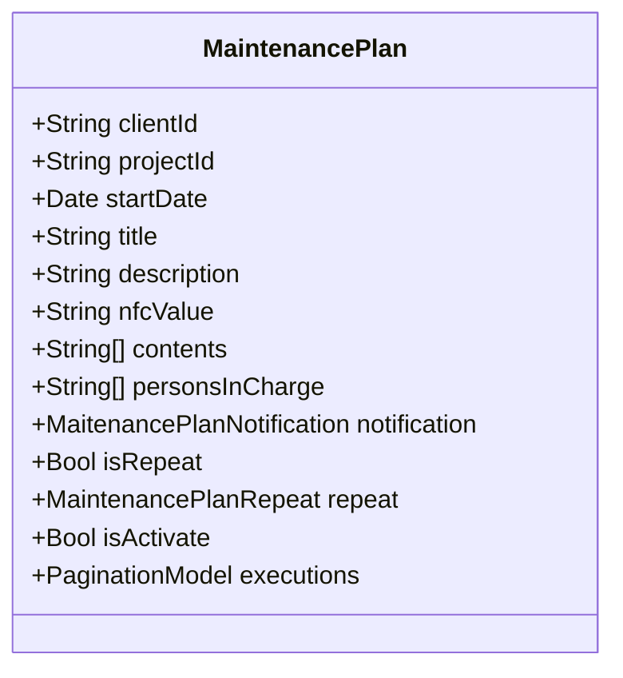
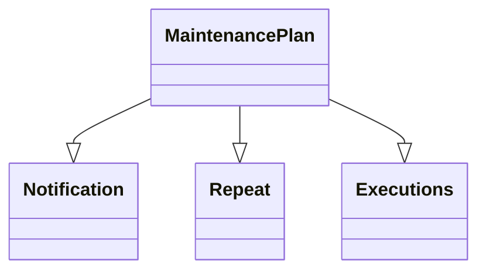

# Bảo trì

import Tabs from "@theme/Tabs";
import TabItem from "@theme/TabItem";

## Mô hình dữ liệu


## Mối quan hệ với các mô hình khác



<Tabs>
<TabItem value="service" label="API Service">

```typescript title="/src/app/services/maintenance/manual-maitenance-plans.service.ts"
import { HttpClient, HttpHeaders } from "@angular/common/http";
import { Injectable } from "@angular/core";
import { catchError, firstValueFrom, pipe } from "rxjs";
import { ApiResponse } from "src/app/models/api/api-response.model";
import { ManualMaintenancePlanPostModel } from "src/app/models/maintenance/manual-maintenance-plan/manual-maintenance-plan-post.model";
import { ManualMaintenancePlanPutModel } from "src/app/models/maintenance/manual-maintenance-plan/manual-maintenance-plan-put.model";
import { ManualMaintenancePlanResponseModel } from "src/app/models/maintenance/manual-maintenance-plan/manual-maintenance-plan-response.model";
import { ManualMaintenancePlan } from "src/app/models/maintenance/manual-maintenance-plan/manual-maintenance-plan.model";
import { PaginationResponseModel } from "src/app/models/pagination/pagination.response.model";
import { ProjectModel } from "src/app/models/project/project.model";
import { BaseService } from "../base/base.service";
import { LoadingService } from "../loading/loading-service";
import { MessageService } from "../message/message.service";

@Injectable()
export class ManualMaintenancePlanService extends BaseService {

    constructor(
        private http: HttpClient
        , private messageService: MessageService
        , private loadingService: LoadingService
    )
    {
        super();
        this.baseAddress = `[fmApi]/v1/[clientId]/[projectId]/manual-maintenance-plans`;

    }

    private baseAddress: string;
    private httpOptions = {
        headers: new HttpHeaders({
            'Content-Type': 'application/json'
        })
    };

    public async get(
        project: ProjectModel,
        pageIndex:number
        )
    {
        try
        {
            const pageData = project.manualMaintenancePlans.pages.find(x => x.pageIndex === pageIndex);
            if (pageData) return pageData.items;
            this.loadingService.show("");
            const response = await firstValueFrom(this.http.get<ApiResponse<PaginationResponseModel<ManualMaintenancePlanResponseModel>>>(`${this.baseAddress}/page/${pageIndex}`, this.httpOptions)
            .pipe(
                catchError(this.handleError)
            ));
            this.loadingService.hide();
            if(response.result)
            {
                const data = response.result.items.map(x=>new ManualMaintenancePlan(x));
                project.manualMaintenancePlans.total = response.result.total;
                project.manualMaintenancePlans.addPageByItems(data,pageIndex);
                return data;
            }
            else
            {
                this.messageService.setErrorMessage(response.errorMessage);
                return false;
            }
        }
        catch(err) {
            this.loadingService.hide();
            console.error(err);
            this.messageService.setErrorMessage("Error: Can not connect to the server!");
            return false;
        }

    }

    public async post(
        postModel: ManualMaintenancePlanPostModel
    ) {
        try {
            this.loadingService.show("Đang tạo mới..");
            const response = await firstValueFrom(this.http.post<ApiResponse<ManualMaintenancePlanResponseModel>>(`${this.baseAddress}`, postModel, this.httpOptions)
                .pipe(
                    catchError(this.handleError)
                ));
            this.loadingService.hide();
            if (response?.result) {
                const item = new ManualMaintenancePlan(response.result);
                this.messageService.setMessage("Tạo mới thành công!");

                return item;
            }
            else {
                this.messageService.setErrorMessage(response.errorMessage);
                return false;
            }
        }
        catch (err) {
            this.loadingService.hide();
            console.error(err);
            this.messageService.setErrorMessage("Error: Can not connect to the server!");
            return false;
        }
    }

    public async put(
        putModel: ManualMaintenancePlanPutModel
    ) {
        try {
            this.loadingService.show("Đang cập nhật..");
            const response = await firstValueFrom(this.http.put<ApiResponse<ManualMaintenancePlanResponseModel>>(`${this.baseAddress}`, putModel, this.httpOptions)
                .pipe(
                    catchError(this.handleError)
                ));
            this.loadingService.hide();
            if (response?.result) {
                const item = new ManualMaintenancePlan(response.result);
                this.messageService.setMessage("Cập nhật thành công!");

                return item;
            }
            else {
                this.messageService.setErrorMessage(response.errorMessage);
                return false;
            }
        }
        catch (err) {
            this.loadingService.hide();
            console.error(err);
            this.messageService.setErrorMessage("Error: Can not connect to the server!");
            return false;
        }
    }

    public async delete(
        id: string
    ) {
        try {
            this.loadingService.show("Đang xóa..");
            const response = await firstValueFrom(this.http.delete<ApiResponse<object>>(`${this.baseAddress}/${id}`, this.httpOptions)
                .pipe(
                    catchError(this.handleError)
                ));
            this.loadingService.hide();
            if (response?.successful) {
                this.messageService.setMessage("Xóa thành công!");
                return true;
            }
            else {
                this.messageService.setErrorMessage(response.errorMessage);
                return false;
            }
        }
        catch (err) {
            this.loadingService.hide();
            console.error(err);
            this.messageService.setErrorMessage("Error: Can not connect to the server!");
            return false;

        }
    }
}

```

</TabItem>

<TabItem value="html" label="Html">

```html title="/src/app/components/maintenance/maintenance.component.html"
<div id="manual-maintenance-plan">
    <div class="display-flex flex-direction-column">
        <app-calendar (dayClickedEvent)="dayClick($event)" (changeMonthEvent)="monthChange($event)" [events]="events"></app-calendar>
        <app-maintenance-list class="mr-top-1rem" (loadEvent)="progressEvent($event)"></app-maintenance-list>
    </div>

    <div [ngClass]="isReverse ? 'create-event-table-reverse':''" class="create-event-table" *ngIf="createEventTableVisibility" [style.Left.px]="offsetX" [style.Top.px]="offsetY">
        <button mat-raised-button (click)="createEventTableContainerVisibility = true;createEventTableVisibility=false">Create Event</button>

    </div>
    <div class="create-event-table-container" *ngIf="createEventTableContainerVisibility" (click)="createEventTableContainerVisibility=false">
        <mat-card appearance="outlined" clickStopPropagation>
            <app-maintenance-add-event-table (createdEvent)="addEvent($event)" (createdMaintenancePlan)="addPlan($event)" [selectedDate]="selectedDate"></app-maintenance-add-event-table>
        </mat-card>
    </div>

</div>

```

</TabItem>

<TabItem value="scss" label="Scss">

```scss title="/src/app/components/maintenance/maintenance.component.scss"
#manual-maintenance-plan {
    margin: auto;
    padding: 1rem;
     ::ng-deep .cal-day-number {
        opacity: 1;
        color: unset;
    }

    ::ng-deep .cal-out-month {
        opacity: 0.5;
    }

    ::ng-deep .cal-day-cell.cal-weekend {
        color: #1976d2 !important;
    }

    ::ng-deep .cal-day-cell.cal-today {
        background-color: #1976d24d;
    }

    ::ng-deep .cal-header {
        font-weight: 500;
    }
     ::ng-deep .cal-day-badge {
        background-color: rgba(251, 192, 45, 1);
    }
     ::ng-deep .cal-open-day-events {
        box-shadow: none;
        background-color: rgba(251, 192, 45, 0.4);
        color: black;
    }
    .title-action {
        h2 {
            margin: 0px;
        }
    }
    .create-event-table {
        position: fixed;
    }
    .create-event-table-container {
        position: absolute;
        display: flex;
        justify-content: center;
        align-items: center;
        background-color: rgba(0, 0, 0, 0.4);
        top: 0px;
        left: 0px;
        right: 0px;
        bottom: 0px;
        z-index: 20;
    }
    .create-event-table-reverse {
        transform: translateX(-100%);
    }
}

```

</TabItem>

<TabItem value="typescript" label="Typescript">

```typescript title="/src/app/components/maintenance/maintenance.component.ts"
import { Component, OnInit, SimpleChanges, ViewChild } from '@angular/core';
import { CalendarEvent} from 'angular-calendar';
import { Frequency, RRule } from 'rrule';
import { MaintenancePlanRepeatType } from 'src/app/models/maintenance/maintenance-plan-repeat.type';
import { ManualMaintenancePlanPostModel } from 'src/app/models/maintenance/manual-maintenance-plan/manual-maintenance-plan-post.model';
import { ManualMaintenancePlan } from 'src/app/models/maintenance/manual-maintenance-plan/manual-maintenance-plan.model';
import { ColorService } from 'src/app/services/color/color.service';
import { ManualMaintenancePlanService } from 'src/app/services/maintenance/manual-maintenance-plans.service';
import { ProjectService } from 'src/app/services/project/project.service';
import { MaintenanceListComponent } from './list/maintenance-list.component';

@Component({
  selector: 'app-maintenance',
  templateUrl: './maintenance.component.html',
  styleUrls: ['./maintenance.component.scss']
})
export class MaintenanceComponent implements OnInit {

    events: CalendarEvent[] = [];
    viewDate:Date = new Date();
    private secondaryColor = '#1976d24d';
    constructor(private manualMaintenancePlanService: ManualMaintenancePlanService
        , private colorService: ColorService
        , private projectService:ProjectService) { }

    ngOnChanges(changes: SimpleChanges): void {
        if (changes["item"]?.previousValue) {
        this.events = [];
        }
    }


    ngOnInit(): void {
    }

    //#region Calendar Event
    public dayClick(event:any){
        this.selectedDate = event.day.date;
        if (this.offsetX != null || this.offsetY != null) {
        this.offsetX = null;
        this.offsetY = null;
        this.createEventTableVisibility = false;
        }
        else {
        this.offsetX = event.sourceEvent.clientX - event.sourceEvent.offsetX;
        this.offsetY = event.sourceEvent.clientY - event.sourceEvent.offsetY;
        this.createEventTableVisibility = true;
        if ((window.innerWidth - event.sourceEvent.clientX) < 350) {
            this.isReverse = true
        }
        else {
            this.isReverse = false;
        }
        }
    }

    public monthChange(date:Date)
    {
        this.endDateOnCalendar = new Date(date.getFullYear(), date.getMonth() + 1, 0);
        this.events = []
        this.progressEvent(this.manualMaintenancePlans)
    }
    //#endregion

    //#region Create Event Table
    public createEventTableVisibility: boolean = false;
    public createEventTableContainerVisibility: boolean = false;
    public offsetX: number | null = null;
    public offsetY: number | null = null;
    public isReverse: boolean = false;
    public selectedDate?: Date;

    public addEvent(event: CalendarEvent) {
        this.events = [
        ...this.events, event];
        this.createEventTableVisibility = false;
        this.maintenanceListComponent?.gets(true);
    }

    public async addPlan(postModel: ManualMaintenancePlanPostModel) {

        let res = await this.manualMaintenancePlanService.post(postModel);
        if (res) {
            res.eventColor = this.colorService.randomColor();
            this.projectService.currentProject!.manualMaintenancePlans.addItem(res);
            this.progressEvent(this.projectService.currentProject!.manualMaintenancePlans.cache);
        }
    }
    //#endregion

    //#region Progress Event
    public manualMaintenancePlans: ManualMaintenancePlan[] = [];
    private endDateOnCalendar?: Date = new Date(this.viewDate.getFullYear(), this.viewDate.getMonth() + 1, 0);
    public progressEvent(events: ManualMaintenancePlan[]) {
        this.events = [];
        // console.log(events)
        if (events.length > 0) {
        this.manualMaintenancePlans = events;
        for (let index = 0; index < events.length; index++) {
            const element = events[index];
            if (!element.isRepeat) {
            let calendarEvent: CalendarEvent = { title: element.title, start: element.startDate!, color: { primary: element.eventColor!, secondary: this.secondaryColor } }
            this.events = [
                ...this.events, calendarEvent];
            }
            else {
            switch (element.repeat.type) {
                case MaintenancePlanRepeatType.DAY:
                const recurringEventDay = new RRule({ freq: Frequency.DAILY, interval: element.repeat.range, dtstart: element.startDate, until: this.endDateOnCalendar });
                let datesDay = recurringEventDay.all();
                for (let index = 0; index < datesDay.length; index++) {
                    const date = datesDay[index];
                    let calendarEvent: CalendarEvent = { title: element.title, start: date, color: { primary: element.eventColor!, secondary: this.secondaryColor } }

                    this.events = [...this.events, calendarEvent];
                }
                break;
                case MaintenancePlanRepeatType.WEEK:
                // let day = element.startDate?.getDay();
                const recurringEvent = new RRule({ freq: Frequency.WEEKLY, interval: element.repeat.range, dtstart: element.startDate, until: this.endDateOnCalendar });
                let dates = recurringEvent.all();
                for (let index = 0; index < dates.length; index++) {
                    const date = dates[index];
                    let calendarEvent: CalendarEvent = { title: element.title, start: date, color: { primary: element.eventColor!, secondary: this.secondaryColor } }

                    this.events = [...this.events, calendarEvent];
                }
                break;
                case MaintenancePlanRepeatType.MONTH:
                // let dayOfMonth = element.startDate?.getDate();

                const recurringEventMonth = new RRule({ freq: Frequency.MONTHLY, interval: element.repeat.range, dtstart: element.startDate, until: this.endDateOnCalendar });
                let datesMonth = recurringEventMonth.all();
                for (let index = 0; index < datesMonth.length; index++) {
                    const date = datesMonth[index];
                    let calendarEvent: CalendarEvent = { title: element.title, start: date, color: { primary: element.eventColor!, secondary: this.secondaryColor } }

                    this.events = [...this.events, calendarEvent];
                }
                break;
                case MaintenancePlanRepeatType.YEAR:

                const recurringEventYear = new RRule({ freq: Frequency.YEARLY, interval: element.repeat.range, dtstart: element.startDate, until: this.endDateOnCalendar });
                let datesYear = recurringEventYear.all();
                for (let index = 0; index < datesYear.length; index++) {
                    const date = datesYear[index];
                    let calendarEvent: CalendarEvent = { title: element.title, start: date, color: { primary: element.eventColor!, secondary: this.secondaryColor } }

                    this.events = [...this.events, calendarEvent];
                }
                break;
            }

            // recurringEvent.options.freq
            }

        }
        }
    }
    //#endregion


    //#region List
    @ViewChild(MaintenanceListComponent) maintenanceListComponent: MaintenanceListComponent | null = null;
    //#endregion
}

```

</TabItem>

</Tabs>
