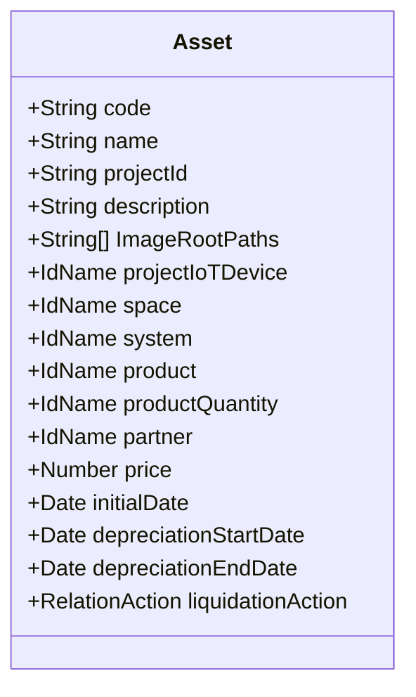
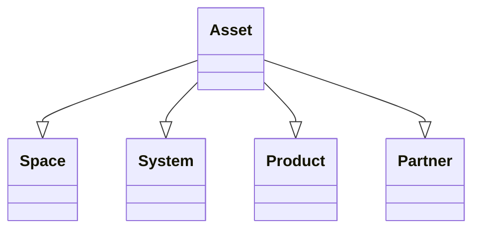

# Tài sản

import Tabs from "@theme/Tabs";
import TabItem from "@theme/TabItem";

## Mô hình dữ liệu


## Mối quan hệ với các mô hình khác



<Tabs>
<TabItem value="service" label="API Service">

```typescript title="/src/app/services/asset/asset.service.ts"
import { HttpClient, HttpHeaders } from "@angular/common/http";
import { Injectable } from "@angular/core";
import { catchError, firstValueFrom, Observable, of } from "rxjs";
import { ApiResponse } from "src/app/models/api/api-response.model";
import { Asset } from "src/app/models/asset/asset.model";
import { AssetResponseModel } from "src/app/models/asset/asset.response.model";
import { BaseService } from "../base/base.service";
import { ConfigService } from "../config/config.service";
import { ImageService } from "../image/image.service";
import { LoadingService } from "../loading/loading-service";
import { MessageService } from "../message/message.service";
import { Image } from "src/app/models/image/image.model";
import { AssetPutModel } from "src/app/models/asset/asset.put.model";
import { ProjectModel } from "src/app/models/project/project.model";
import { CacheManagerService } from "../cache-manager/cache-manager.service";
import { PaginationResponseModel } from "src/app/models/pagination/pagination.response.model";
import { PaginationData } from "src/app/models/pagination/pagination-data.model";
import { FileResponseModel } from "src/app/models/file/file.response.model";
import { FileModel } from "src/app/models/file/file.model";
import { FilesService } from "../file/files.service";
import { Project_v2_Service } from "../project-v2/project-v2.service";

@Injectable()
export class AssetService extends BaseService {

    constructor(
        private http: HttpClient
        , private messageService: MessageService
        , private imageService: ImageService
        , private loadingService: LoadingService
        , private configService: ConfigService
        , private cacheManagerService: CacheManagerService
        , private filesService: FilesService
        , private project_v2_Service: Project_v2_Service
    )
    {
        super();
        this._baseAddress = `[fmApi]/v1/[clientId]/[projectId]/assets`;

    }

    private _baseAddress: string;
    private _httpOptions = {
        headers: new HttpHeaders({
            'Content-Type': 'application/json'
        })
    };

    public async get(
        assetId: string,
        forceNew: boolean = false,
        loadingDivId: string = ""
        )
    {
        try
        {
            this.loadingService.show("", -1, loadingDivId);
            const response = await firstValueFrom(this.http.get<ApiResponse<AssetResponseModel>>(`${this._baseAddress}/single-${assetId}`,
                this.cacheManagerService.getLocalCacheHttpOptions(this._httpOptions.headers, 60, forceNew)
            )
            .pipe(
                catchError(this.handleError)
            ));
            this.loadingService.hide(loadingDivId);

            if(response.result)
            {
                const item = new Asset(response.result, this.configService.appConfig.CM_URL.URL);
                return item;
            }
            else
            {
                this.messageService.setErrorMessage(response.errorMessage);
                return false;
            }
        }
        catch(err) {
            this.loadingService.hide(loadingDivId);
            console.error(err);
            this.messageService.setErrorMessage("Error: Can not connect to the server!");
            return false;
        }

    }

    public async gets(
        status: string = "all",
        system: string = "ALL",
        from: number = -1,
        to: number = -1,
        pageIndex: number = 0,
        forceNew: boolean = false,
        loadingDivId: string = ""
        )
    {
        try
        {
            if(!status || status.length < 1 || (status.includes("all") && status.length > 1)) status = "all";
            if(!system || system.length < 1 || (system.includes("ALL") && system.length > 1)) system = "ALL";
            this.loadingService.show("", -1, loadingDivId);
            const response = await firstValueFrom(this.http.get<ApiResponse<PaginationResponseModel<AssetResponseModel>>>(`${this._baseAddress}/page-${pageIndex}/filter?from=${from}&status=${status}&system=${system}&to=${to}`,
                this.cacheManagerService.getLocalCacheHttpOptions(this._httpOptions.headers, 30, forceNew)
            )
            .pipe(
                catchError(this.handleError)
            ));
            this.loadingService.hide(loadingDivId);
            if(response.result)
            {
                const data = response.result.items.map(x => new Asset(x, this.configService.appConfig.CM_URL.URL));
                return new PaginationData(data, response.result.total);
            }
            else
            {
                this.messageService.setErrorMessage(response.errorMessage);
                return false;
            }

        }
        catch(err) {
            this.loadingService.hide(loadingDivId);
            console.error(err);
            this.messageService.setErrorMessage("Error: Can not connect to the server!");
            return false;
        }

    }

    public async getImages(item: Asset, loadingDivId: string = "")
    {
        if(item.image.isRetrieved) return true;

        this.messageService.clearMessage();
        try
        {
            const response = await this.imageService.getsByHostId(item.id, false, loadingDivId);
            if(response && response.length > 0)
            {
                const items = response.map(x => new Image(x, this.configService.appConfig.CM_URL.URL));
                item.image.set(items);
                item.processImageRootPaths(this.configService.appConfig.CM_URL.URL);
                return true;
            }
            else
            {
                item.image.set([]);
            }

            return false;
        }
        catch(err)
        {
            console.error(err);
            this.loadingService.hide(loadingDivId);
            this.messageService.setErrorMessage("Error: Can not connect to the server!");
            return false;
        }
    }

    public search(keyword: string, spaceId: string = "", statuses: string[] = ['all'], systems: string[] = ['ALL'], from: number = -1, to: number = -1): Observable<ApiResponse<AssetResponseModel[]>>
    {
        //console.log(from);
        //console.log(to);
        this.messageService.clearMessage();
        if (!keyword || !keyword?.trim() || keyword.trim().length < 3) {
            // if not search term, return empty hero array.
            return of(new ApiResponse<AssetResponseModel[]>());
        }
        let status = statuses ? statuses.join(",") : "all";
        if(!status || status.length < 1 || (status.includes("all") && status.length > 1)) status = "all";
        let system = systems ? systems.join(",") : "ALL";
        if(!system || system.length < 1 || (system.includes("ALL") && system.length > 1)) system = "ALL";

        if(spaceId && spaceId.length === 24)
        {
            return this.http.get<ApiResponse<AssetResponseModel[]>>(`${this._baseAddress}/space-${spaceId}/search/${keyword.trim()}/filter?from=${from}&status=${status}&system=${system}&to=${to}`, this._httpOptions)
            .pipe(
                catchError(this.handleError)
            );
        }

        return this.http.get<ApiResponse<AssetResponseModel[]>>(`${this._baseAddress}/search/${keyword.trim()}/filter?from=${from}&status=${status}&system=${system}&to=${to}`, this._httpOptions)
            .pipe(
                catchError(this.handleError)
            );
    }

    public async put(
        model: AssetPutModel,
        loadingDivId: string = ""
    )
    {
        try
        {
            this.loadingService.show("", -1, loadingDivId);
            const response = await firstValueFrom(this.http.put<ApiResponse<AssetResponseModel>>(`${this._baseAddress}`, model, this._httpOptions)
                .pipe(
                    catchError(this.handleError)
                ));
            this.loadingService.hide(loadingDivId);
            if(response?.result)
            {
                const item = new Asset(response.result, this.configService.appConfig.CM_URL.URL);
                //console.log(item);
                this.messageService.setMessage("successfully");
                if(this.project_v2_Service.currentProject)
                {
                    this.project_v2_Service.currentProject.asset.add(item);
                }

                return item;
            }
            else
            {
                this.messageService.setErrorMessage(response.errorMessage);
                return false;
            }
        }
        catch(err) {
            this.loadingService.hide(loadingDivId);
            console.error(err);
            this.messageService.setErrorMessage("Error: Can not connect to the server!");
            return false;
        }
    }


    //#region Export
    public async getsExport(
        pageIndex: number,
        forceNew: boolean = false,
        loadingDivId: string = ""
    )
    {
        this.messageService.clearMessage();
        try
        {
            this.loadingService.show("", -1, loadingDivId);
            const response = await firstValueFrom(this.http.get<ApiResponse<PaginationResponseModel<FileResponseModel>>>(`${this._baseAddress}/export/page-${pageIndex}`
                , this.cacheManagerService.getLocalCacheHttpOptions(this._httpOptions.headers, 60, forceNew)
            )
            .pipe(
                catchError(this.handleError)
            ));
            this.loadingService.hide(loadingDivId);
            if(response?.result)
            {
                if(response.result.items.length > 0)
                {
                    const items = response.result.items.map(x => new FileModel(x));
                    return new PaginationData(items, response.result.total);
                }
                return new PaginationData([], response.result.total);
            }
            else
            {
                this.messageService.setErrorMessage(response.errorMessage);
                return false;
            }
        }
        catch(err)
        {
            console.error(err);
            this.loadingService.hide(loadingDivId);
            this.messageService.setErrorMessage("Error: Can not connect to the server!");
            return false;
        }
    }

    public async export()
    {
        try
        {
            this.loadingService.show();
            const response = await firstValueFrom(this.http.post<ApiResponse<boolean>>(`${this._baseAddress}/export`, this._httpOptions)
                .pipe(
                    catchError(this.handleError)
                ));
            this.loadingService.hide();
            if(response?.result)
            {
                this.messageService.setMessage("The exporting task's executing, will notice you when finish!");

                return true;
            }
            else
            {
                this.messageService.setErrorMessage(response.errorMessage);
                return false;
            }
        }
        catch(err) {
            this.loadingService.hide();
            console.error(err);
            this.messageService.setErrorMessage("Error: Can not connect to the server!");
            return false;
        }
    }

    public async viewExport(item: FileModel)
    {
        this.messageService.clearMessage();
        try
        {
            this.loadingService.show();
            const response = await firstValueFrom(this.http.get(`${this._baseAddress}/export/view/${item.id}`, {
                responseType : 'blob'
            })
            .pipe(
                catchError(this.handleError)
            ));

            this.loadingService.hide();

            await this.filesService.viewFileFromBlob(response, item.originalFileName);
            return true;
        }
        catch(err)
        {
            console.error(err);
            this.loadingService.hide();
            this.messageService.setErrorMessage("Error: Can not connect to the server!");
            return false;
        }
    }
    //#endregion
}

```

</TabItem>

<TabItem value="html" label="Html">

```html title="/src/app/components/asset-v2/detail/asset-v2-detail.component.html"
<div id="asset-v2-detail" class="position-relative display-flex flex-direction-column" *ngIf="item">
    <div class="content-title">{{ item.code + ": " + item.name }}</div>
    <mat-tab-group animationDuration="0ms">
        <mat-tab label="Information">
            <ng-template matTabContent>
                <app-asset-v2-information [item]="item" [loadingName]="'asset-v2-detail-loading'"></app-asset-v2-information>
            </ng-template>
        </mat-tab>
        <mat-tab label="Actions">
            <ng-template matTabContent>
                <div class="height-1rem"></div>
                <app-asset-v2-action [item]="item" [loadingName]="'asset-v2-detail-loading'"></app-asset-v2-action>
            </ng-template>
        </mat-tab>
        <mat-tab label="Report History">
            <ng-template matTabContent>
                <app-asset-v2-report [item]="item" [loadingDivId]="'asset-v2-detail-loading'"></app-asset-v2-report>
            </ng-template>
        </mat-tab>
        <mat-tab label="Maintenance Plan">
            <ng-template matTabContent>
                <app-asset-v2-maintenance-plan [item]="item" [loadingDivId]="'asset-v2-detail-loading'"></app-asset-v2-maintenance-plan>
            </ng-template>
        </mat-tab>
        <mat-tab label="Documents">
            <ng-template matTabContent>

            </ng-template>
        </mat-tab>
    </mat-tab-group>
    <app-loading [id]="'asset-v2-detail-loading'"></app-loading>
</div>

```

</TabItem>

<TabItem value="scss" label="Scss">

```scss title="/src/app/components/asset-v2/detail/asset-v2-detail.component.scss"

```

</TabItem>

<TabItem value="typescript" label="Typescript">

```typescript title="/src/app/components/asset-v2/detail/asset-v2-detail.component.ts"
import { Component, Input } from "@angular/core";
import { Asset } from "src/app/models/asset/asset.model";
import { NgIf } from "@angular/common";
import { MatTabsModule } from "@angular/material/tabs";
import { LoadingComponent } from "../../global/loading/loading.component";
import { AssetInformationComponent_v2 } from "../information/asset-v2-information.component";
import { AssetActionComponent_v2 } from "../action/asset-v2-action.component";
import { AssetReportComponent_v2 } from "../report/asset-v2-report.component";
import { AssetMaintenancePlanComponent_v2 } from "../maintenance-plan/asset-v2-maintenance-plan.component";

@Component({
    standalone: true,
    imports: [
        LoadingComponent,
        AssetInformationComponent_v2,
        AssetActionComponent_v2,
        AssetReportComponent_v2,
        AssetMaintenancePlanComponent_v2,

        NgIf,
        MatTabsModule,
    ],
    providers: [
    ],
    selector: 'app-asset-v2-detail',
    templateUrl: './asset-v2-detail.component.html'
})

export class AssetDetailComponent_v2
{
    @Input() item: Asset | null = null;
}

```

</TabItem>

</Tabs>
