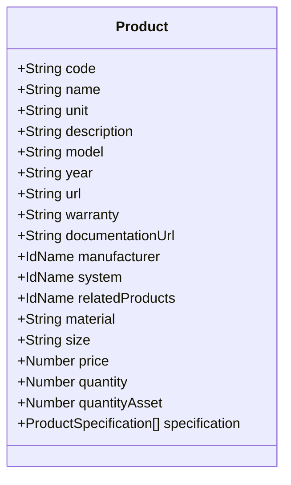
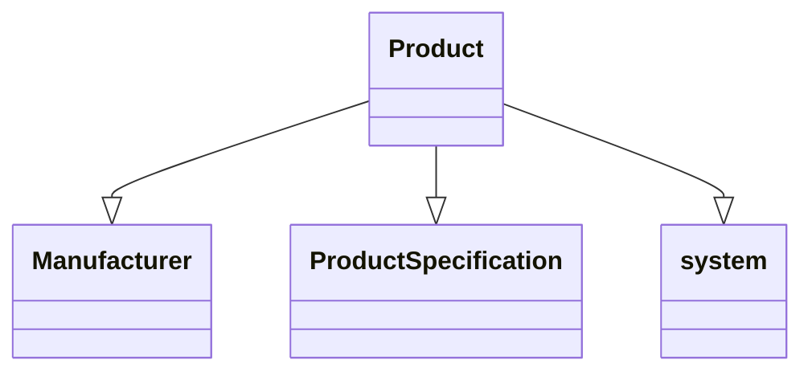

# Sản phẩm

import Tabs from "@theme/Tabs";
import TabItem from "@theme/TabItem";

## Mô hình dữ liệu



## Mối quan hệ với các mô hình khác



<Tabs>
<TabItem value="service" label="API Service">

```typescript title="/src/app/services/product/product.service.ts"
import { HttpClient, HttpHeaders } from "@angular/common/http";
import { Injectable } from "@angular/core";
import { catchError, firstValueFrom, Observable, of } from "rxjs";
import { ApiResponse } from "src/app/models/api/api-response.model";
import { DocumentResponseModel } from "src/app/models/document/document.response.model";
import { FileModel } from "src/app/models/file/file.model";
import { FileResponseModel } from "src/app/models/file/file.response.model";
import { Image } from "src/app/models/image/image.model";
import { PaginationResponseModel } from "src/app/models/pagination/pagination.response.model";
import { ProductDocumentPostModel } from "src/app/models/product/product-document.post.model";
import { ProductImportingPostModel } from "src/app/models/product/product-importing-table-element.model";
import { Product } from "src/app/models/product/product.model";
import { ProductPostModel } from "src/app/models/product/product.post.model";
import { ProductPutModel } from "src/app/models/product/product.put.model";
import { ProductResponseModel } from "src/app/models/product/product.response.model";
import { BaseService } from "../base/base.service";
import { ConfigService } from "../config/config.service";
import { FilesService } from "../file/files.service";
import { ImageService } from "../image/image.service";
import { LoadingService } from "../loading/loading-service";
import { MessageService } from "../message/message.service";
import { Document } from "src/app/models/document/document.model";
import { DocumentVersion } from "src/app/models/document/document-version.model";
import { ProductAssetPostModel } from "src/app/models/product/product-asset.post.model";
import { AssetResponseModel } from "src/app/models/asset/asset.response.model";
import { Asset } from "src/app/models/asset/asset.model";
import { CacheManagerService } from "../cache-manager/cache-manager.service";
import { PaginationData } from "src/app/models/pagination/pagination-data.model";

@Injectable()
export class ProductService extends BaseService {
  constructor(
    private http: HttpClient,
    private configService: ConfigService,
    private messageService: MessageService,
    private loadingService: LoadingService,
    private filesService: FilesService,
    private imageService: ImageService,
    private cacheManagerService: CacheManagerService
  ) {
    super();
    this._baseAddress = `[fmApi]/v1/[clientId]/[projectId]/products`;
  }

  private _baseAddress: string;
  private _httpOptions = {
    headers: new HttpHeaders({
      "Content-Type": "application/json",
    }),
  };

  private _clearLocalCache(withRoute: string = "") {
    if (withRoute && withRoute.length > 0) {
      this.cacheManagerService.clearLocalCacheWithNameIncluding([
        "/api/",
        "/products",
        withRoute,
      ]);
    } else {
      this.cacheManagerService.clearLocalCacheWithNameIncluding([
        "/api/",
        "/products",
      ]);
    }
  }

  private _clearLocalCache2(withRoutes: string[] = []) {
    if (withRoutes && withRoutes.length > 0) {
      this.cacheManagerService.clearLocalCacheWithNameIncluding(
        ["/api/", "/products"].concat(withRoutes)
      );
    } else {
      this.cacheManagerService.clearLocalCacheWithNameIncluding([
        "/api/",
        "/products",
      ]);
    }
  }

  public async gets(
    pageIndex: number,
    forceNew: boolean = false,
    loadingDivId: string = ""
  ) {
    try {
      this.loadingService.show("", -1, loadingDivId);
      const response = await firstValueFrom(
        this.http
          .get<ApiResponse<PaginationResponseModel<ProductResponseModel>>>(
            `${this._baseAddress}/page-${pageIndex}`,
            this.cacheManagerService.getLocalCacheHttpOptions(
              this._httpOptions.headers,
              60,
              forceNew
            )
          )
          .pipe(catchError(this.handleError))
      );
      this.loadingService.hide(loadingDivId);
      if (response.result) {
        const items = response.result.items.map((x) => new Product(x));
        return new PaginationData(items, response.result.total);
      } else {
        this.messageService.setErrorMessage(response.errorMessage);
        return false;
      }
    } catch (err) {
      this.loadingService.hide(loadingDivId);
      console.error(err);
      this.messageService.setErrorMessage(
        "Error: Can not connect to the server!"
      );
      return false;
    }
  }

  public async get(
    productId: string,
    forceNew: boolean = false,
    loadingDivId: string = ""
  ) {
    try {
      this.loadingService.show("", -1, loadingDivId);
      const response = await firstValueFrom(
        this.http
          .get<ApiResponse<ProductResponseModel>>(
            `${this._baseAddress}/single/${productId}`,
            this.cacheManagerService.getLocalCacheHttpOptions(
              this._httpOptions.headers,
              60,
              forceNew
            )
          )
          .pipe(catchError(this.handleError))
      );
      this.loadingService.hide(loadingDivId);

      if (response.result) {
        const item = new Product(response.result);
        return item;
      } else {
        this.messageService.setErrorMessage(response.errorMessage);
        return false;
      }
    } catch (err) {
      this.loadingService.hide(loadingDivId);
      console.error(err);
      this.messageService.setErrorMessage(
        "Error: Can not connect to the server!"
      );
      return false;
    }
  }

  public async post(model: ProductPostModel, loadingDivId: string = "") {
    try {
      this.loadingService.show("", -1, loadingDivId);
      const response = await firstValueFrom(
        this.http
          .post<ApiResponse<ProductResponseModel>>(
            `${this._baseAddress}`,
            model,
            this._httpOptions
          )
          .pipe(catchError(this.handleError))
      );
      this.loadingService.hide(loadingDivId);
      if (response?.result) {
        const item = new Product(response.result);
        this.messageService.setMessage("Successfully!");
        this._clearLocalCache();
        return item;
      } else {
        this.messageService.setErrorMessage(response.errorMessage);
        return false;
      }
    } catch (err) {
      this.loadingService.hide(loadingDivId);
      console.error(err);
      this.messageService.setErrorMessage(
        "Error: Can not connect to the server!"
      );
      return false;
    }
  }

  public async postAsset(
    product: Product,
    model: ProductAssetPostModel,
    loadingDivId: string = ""
  ) {
    try {
      this.loadingService.show("", -1, loadingDivId);
      const response = await firstValueFrom(
        this.http
          .post<ApiResponse<AssetResponseModel[]>>(
            `${this._baseAddress}/assets`,
            model,
            this._httpOptions
          )
          .pipe(catchError(this.handleError))
      );
      this.loadingService.hide(loadingDivId);
      if (response?.result) {
        if (response.result.length > 0) {
          const items = response.result.map(
            (x) => new Asset(x, this.configService.appConfig.CM_URL.URL)
          );
          product.quantityAsset += items.length;
          this.messageService.setMessage("Successfully: " + items.length, -1);
          return items;
        } else {
          this.messageService.setErrorMessage("No asset's created", -1);
          return [];
        }
      } else {
        this.messageService.setErrorMessage(response.errorMessage);
        return false;
      }
    } catch (err) {
      this.loadingService.hide(loadingDivId);
      console.error(err);
      this.messageService.setErrorMessage(
        "Error: Can not connect to the server!"
      );
      return false;
    }
  }

  public async getAsset(
    product: Product,
    pageIndex: number = 0,
    loadingDivId: string = ""
  ) {
    try {
      const cache = product.asset.page.get(pageIndex);
      if (cache)
        return new PaginationData(cache.items, product.asset.page.total);

      this.loadingService.show("", -1, loadingDivId);
      const response = await firstValueFrom(
        this.http
          .get<ApiResponse<PaginationResponseModel<AssetResponseModel>>>(
            `${this._baseAddress}/assets/${product.id}/page-${pageIndex}`,
            this.cacheManagerService.getLocalCacheHttpOptions(
              this._httpOptions.headers,
              60
            )
          )
          .pipe(catchError(this.handleError))
      );
      this.loadingService.hide(loadingDivId);

      if (response.result) {
        product.asset.page.total = response.result.total;
        const data = response.result.items.map(
          (x) => new Asset(x, this.configService.appConfig.CM_URL.URL)
        );
        product.asset.adds(data, pageIndex);
        return new PaginationData(data, response.result.total);
      } else {
        this.messageService.setErrorMessage(response.errorMessage);
        return false;
      }
    } catch (err) {
      this.loadingService.hide(loadingDivId);
      console.error(err);
      this.messageService.setErrorMessage(
        "Error: Can not connect to the server!"
      );
      return false;
    }
  }

  public async put(model: ProductPutModel, loadingDivId: string = "") {
    try {
      this.loadingService.show("", -1, loadingDivId);
      const response = await firstValueFrom(
        this.http
          .put<ApiResponse<ProductResponseModel>>(
            `${this._baseAddress}`,
            model,
            this._httpOptions
          )
          .pipe(catchError(this.handleError))
      );
      this.loadingService.hide(loadingDivId);
      if (response?.result) {
        const item = new Product(response.result);
        this.messageService.setMessage("Successfully!");
        this._clearLocalCache();
        return item;
      } else {
        this.messageService.setErrorMessage(response.errorMessage);
        return false;
      }
    } catch (err) {
      this.loadingService.hide(loadingDivId);
      console.error(err);
      this.messageService.setErrorMessage(
        "Error: Can not connect to the server!"
      );
      return false;
    }
  }

  public search(
    keyword: string
  ): Observable<ApiResponse<ProductResponseModel[]>> {
    if (!keyword?.trim()) {
      // if not search term, return empty hero array.
      return of(new ApiResponse<ProductResponseModel[]>());
    }
    return this.http
      .get<ApiResponse<ProductResponseModel[]>>(
        `${this._baseAddress}/search/${keyword.trim()}`,
        this._httpOptions
      )
      .pipe(catchError(this.handleError));
  }

  public async posts(model: ProductImportingPostModel[]) {
    try {
      this.loadingService.show("");
      const response = await firstValueFrom(
        this.http
          .post<ApiResponse<ProductResponseModel[]>>(
            `${this._baseAddress}/multiple`,
            model,
            this._httpOptions
          )
          .pipe(catchError(this.handleError))
      );
      this.loadingService.hide();
      if (response?.result) {
        const items = response.result.map((x) => new Product(x));
        this.messageService.setMessage(
          "Successfully: " + response?.result.length
        );

        this._clearLocalCache();
        return items;
      } else {
        this.messageService.setErrorMessage(response.errorMessage);
        return false;
      }
    } catch (err) {
      this.loadingService.hide();
      console.error(err);
      this.messageService.setErrorMessage(
        "Error: Can not connect to the server!"
      );
      return false;
    }
  }

  public async export() {
    try {
      this.loadingService.show();
      const response = await firstValueFrom(
        this.http
          .post<ApiResponse<boolean>>(
            `${this._baseAddress}/export`,
            this._httpOptions
          )
          .pipe(catchError(this.handleError))
      );
      this.loadingService.hide();
      if (response?.result) {
        this.messageService.setMessage(
          "The exporting task is executing, will notice you when finish!"
        );

        return true;
      } else {
        this.messageService.setErrorMessage(response.errorMessage);
        return false;
      }
    } catch (err) {
      this.loadingService.hide();
      console.error(err);
      this.messageService.setErrorMessage(
        "Error: Can not connect to the server!"
      );
      return false;
    }
  }

  public async getsExport(
    pageIndex: number,
    forceNew: boolean = false,
    loadingDivId: string = ""
  ) {
    this.messageService.clearMessage();
    try {
      this.loadingService.show("", -1, loadingDivId);
      const response = await firstValueFrom(
        this.http
          .get<ApiResponse<PaginationResponseModel<FileResponseModel>>>(
            `${this._baseAddress}/export/page-${pageIndex}`,
            this.cacheManagerService.getLocalCacheHttpOptions(
              this._httpOptions.headers,
              60,
              forceNew
            )
          )
          .pipe(catchError(this.handleError))
      );
      this.loadingService.hide(loadingDivId);
      if (response?.result) {
        if (response.result.items.length > 0) {
          const items = response.result.items.map((x) => new FileModel(x));
          return new PaginationData(items, response.result.total);
        }
        return new PaginationData([], response.result.total);
      } else {
        this.messageService.setErrorMessage(response.errorMessage);
        return false;
      }
    } catch (err) {
      console.error(err);
      this.loadingService.hide(loadingDivId);
      this.messageService.setErrorMessage(
        "Error: Can not connect to the server!"
      );
      return false;
    }
  }

  public async viewExport(item: FileModel) {
    this.messageService.clearMessage();
    try {
      this.loadingService.show();
      const response = await firstValueFrom(
        this.http
          .get(`${this._baseAddress}/export/view/${item.id}`, {
            responseType: "blob",
          })
          .pipe(catchError(this.handleError))
      );

      this.loadingService.hide();

      await this.filesService.viewFileFromBlob(response, item.originalFileName);
      return true;
    } catch (err) {
      console.error(err);
      this.loadingService.hide();
      this.messageService.setErrorMessage(
        "Error: Can not connect to the server!"
      );
      return false;
    }
  }

  public async getImages(item: Product, loadingDivId: string = "") {
    if (item.image.isRetrieved) return true;

    this.messageService.clearMessage();
    try {
      const response = await this.imageService.getsByHostId(
        item.id,
        false,
        loadingDivId
      );
      if (response && response.length > 0) {
        const items = response.map(
          (x) => new Image(x, this.configService.appConfig.CM_URL.URL)
        );
        item.image.set(items);
        item.processImageRootPaths(this.configService.appConfig.CM_URL.URL);
        return true;
      } else {
        item.image.set([]);
      }

      return false;
    } catch (err) {
      console.error(err);
      this.loadingService.hide(loadingDivId);
      this.messageService.setErrorMessage(
        "Error: Can not connect to the server!"
      );
      return false;
    }
  }

  //#region Document
  public async getsDocument(
    product: Product,
    pageIndex: number,
    loadingDivId: string = ""
  ) {
    try {
      if (pageIndex < 0) return false;
      this.loadingService.show("", -1, loadingDivId);
      const response = await firstValueFrom(
        this.http
          .get<ApiResponse<PaginationResponseModel<DocumentResponseModel>>>(
            `${this._baseAddress}/documents/h-${product.id}/page-${pageIndex}`,
            this.cacheManagerService.getLocalCacheHttpOptions(
              this._httpOptions.headers,
              60
            )
          )
          .pipe(catchError(this.handleError))
      );
      this.loadingService.hide(loadingDivId);

      if (response?.result) {
        product.document.page.total = response.result.total;

        if (response.result.items.length > 0) {
          const items = response.result.items.map((x) => new Document(x));
          product.document.adds(items);
          return new PaginationData(items, response.result.total);
        }
        return new PaginationData([], response.result.total);
      } else {
        this.messageService.setErrorMessage(response.errorMessage);
        return false;
      }
    } catch (err) {
      console.error(err);
      this.loadingService.hide(loadingDivId);
      this.messageService.setErrorMessage(
        "Error: Can not connect to the server!"
      );
      return false;
    }
  }

  public async postDocument(
    product: Product,
    model: ProductDocumentPostModel,
    loadingDivId: string = ""
  ) {
    try {
      this.loadingService.show("creating", -1, loadingDivId);
      const response = await firstValueFrom(
        this.http
          .post<ApiResponse<DocumentResponseModel>>(
            `${this._baseAddress}/documents`,
            model,
            this._httpOptions
          )
          .pipe(catchError(this.handleError))
      );
      this.loadingService.hide(loadingDivId);

      if (response?.result) {
        this._clearLocalCache2(["/documents/", "/page"]);
        this.messageService.setMessage("Successfully");
        const item = new Document(response.result);
        product.document.add(item);
        return item;
      } else {
        this.messageService.setErrorMessage(response.errorMessage);
        return false;
      }
    } catch (err) {
      console.error(err);
      this.loadingService.hide(loadingDivId);
      this.messageService.setErrorMessage(
        "Error: Can not connect to the server!"
      );
      return false;
    }
  }

  public async viewDocument(
    product: Product,
    item: DocumentVersion,
    loadingDivId: string = ""
  ) {
    this.messageService.clearMessage();

    try {
      this.loadingService.show("", -1, loadingDivId);

      const response = await firstValueFrom(
        this.http
          .get(
            `${this._baseAddress}/documents/views/p-${product.id}/h-${item.documentId}/${item.id}`,
            {
              responseType: "blob",
            }
          )
          .pipe(catchError(this.handleError))
      );
      //console.log(response);
      this.loadingService.hide(loadingDivId);

      await this.filesService.viewFileFromBlob(
        response,
        item.originalFileName + item.fileExtension
      );
    } catch (err) {
      console.error(err);
      this.loadingService.hide(loadingDivId);
    }
  }

  //#endregion

  public async delete(id: string) {
    try {
      this.loadingService.show("deleting");
      const response = await firstValueFrom(
        this.http
          .delete<ApiResponse<boolean>>(
            `${this._baseAddress}/${id}`,
            this._httpOptions
          )
          .pipe(catchError(this.handleError))
      );
      this.loadingService.hide();
      if (response?.result) {
        this.messageService.setMessage("Successfully");
        this._clearLocalCache();
        return true;
      } else {
        this.messageService.setErrorMessage(response.errorMessage);
        return false;
      }
    } catch (err) {
      console.error(err);
      this.messageService.setErrorMessage(
        "Error: Can not connect to the server!"
      );
      return false;
    }
  }
}
```

</TabItem>

<TabItem value="html" label="Html">

```html title="/src/app/components/product-v2/detail/product-v2-detail.component.html"
<div
  id="product-v2-detail"
  class="position-relative display-flex flex-direction-column"
  *ngIf="item"
>
  <mat-tab-group animationDuration="0ms">
    <mat-tab label="Information">
      <ng-template matTabContent>
        <div class="display-flex flex-direction-column padding-0p5rem">
          <div class="image cursor-pointer" (click)="openImages()">
            
          </div>
          <div class="display-flex flex-direction-column">
            <app-expansion-panel
              [isExpand]="false"
              class="padding-top-1rem"
              [title]="'System'"
            >
              <app-system-v2-information
                *ngIf="item.system && item.system.id"
                [id]="item.system.id"
              ></app-system-v2-information>
            </app-expansion-panel>
            <app-expansion-panel
              class="display-flex flex-direction-column padding-top-1rem"
              [title]="'Information'"
            >
              <app-product-v2-information
                [item]="item"
              ></app-product-v2-information>
            </app-expansion-panel>
          </div>
        </div>
      </ng-template>
    </mat-tab>
    <mat-tab label="Quantity">
      <ng-template matTabContent>
        <app-product-v2-quantity-list
          [item]="item"
        ></app-product-v2-quantity-list>
      </ng-template>
    </mat-tab>
    <mat-tab label="Asset">
      <ng-template matTabContent>
        <app-product-v2-asset-list
          [item]="item"
          [loadingDivId]="loadingDivId"
        ></app-product-v2-asset-list>
      </ng-template>
    </mat-tab>
    <mat-tab label="Maintenance Plan">
      <ng-template matTabContent>
        <app-product-v2-maintenance-plan
          [item]="item"
          [loadingDivId]="loadingDivId"
        ></app-product-v2-maintenance-plan>
      </ng-template>
    </mat-tab>
    <mat-tab label="Documents">
      <ng-template matTabContent>
        <app-product-v2-document [item]="item"></app-product-v2-document>
      </ng-template>
    </mat-tab>
  </mat-tab-group>
  <app-loading [id]="'product-v2-detail-loading'"></app-loading>
</div>
```

</TabItem>

<TabItem value="scss" label="Scss">

```scss title="/src/app/components/product-v2/detail/product-v2-detail.component.scss"
#product-v2-detail {
  .image {
    text-align: center;
    width: 100%;
    img {
      height: 150px;
      object-fit: cover;
      border-radius: 5px;
    }
  }
}
```

</TabItem>

<TabItem value="typescript" label="Typescript">

```typescript title="/src/app/components/product-v2/detail/product-v2-detail.component.ts"
import { Component, Input, OnDestroy, OnInit } from "@angular/core";
import { MatTabsModule } from "@angular/material/tabs";
import { Subscription } from "rxjs";
import { Product } from "src/app/models/product/product.model";
import { ImageLightboxService } from "src/app/services/image-lightbox/image-lightbox.service";
import { ProductService } from "src/app/services/product/product.service";
import { ExpansionPanelComponent } from "../../shared/expansion-panel/expansion-panel.component";
import { SystemInformationComponent_v2 } from "../../system-v2/information/system-v2-information.component";
import { LoadingComponent } from "../../global/loading/loading.component";
import { MatButtonModule } from "@angular/material/button";
import { MatIconModule } from "@angular/material/icon";
import { NgIf } from "@angular/common";
import { MissingImageErrorHandleDirective } from "src/app/directive/no-image-error-handle.directive";
import { ProductQuantityListComponent_v2 } from "../quantity-list/product-v2-quantity-list.component";
import { ProductAssetListComponent_v2 } from "../asset-list/product-v2-asset-list.component";
import { ProductInformationComponent_v2 } from "../information/product-v2-information.component";
import { ProductDocumentComponent_v2 } from "../document/product-v2-document.component";
import { ProductMaintenancePlanComponent_v2 } from "../maintenance-plan/product-v2-maintenance-plan.component";

@Component({
  standalone: true,
  imports: [
    LoadingComponent,
    ExpansionPanelComponent,

    ProductQuantityListComponent_v2,
    ProductAssetListComponent_v2,
    ProductInformationComponent_v2,
    ProductDocumentComponent_v2,
    ProductMaintenancePlanComponent_v2,

    SystemInformationComponent_v2,

    MissingImageErrorHandleDirective,

    NgIf,

    MatTabsModule,
    MatButtonModule,
    MatIconModule,
  ],
  providers: [ProductService],
  selector: "app-product-v2-detail",
  templateUrl: "./product-v2-detail.component.html",
  styleUrls: ["./product-v2-detail.component.scss"],
})
export class ProductDetailComponent_v2 implements OnInit, OnDestroy {
  @Input() item: Product | null = null;
  @Input() loadingDivId: string = "product-v2-detail-loading";

  constructor(
    private productService: ProductService,
    private imageLightboxService: ImageLightboxService
  ) {}

  async ngOnInit() {
    await this.getImages();
  }

  private _subcription: Subscription = new Subscription();
  ngOnDestroy(): void {
    this._subcription.unsubscribe();
  }

  //#region Images
  public async getImages() {
    if (this.item) {
      await this.productService.getImages(this.item, this.loadingDivId);
    }
  }

  public openImages() {
    if (this.item && this.item.image.items.length > 0) {
      this.imageLightboxService.set2(
        this.item.id,
        this.item.image.items,
        this.item.image.items[0].id
      );
    }
  }
  //#endregion
}
```

</TabItem>

</Tabs>
