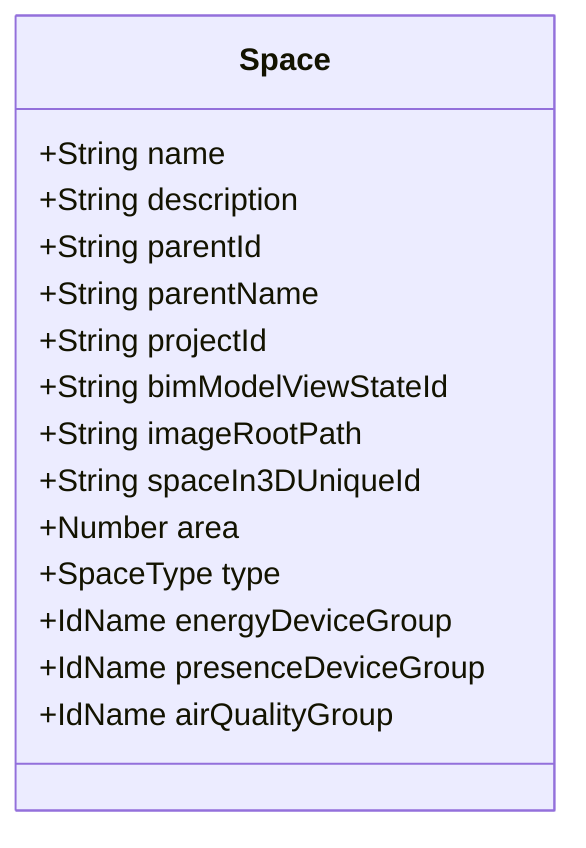
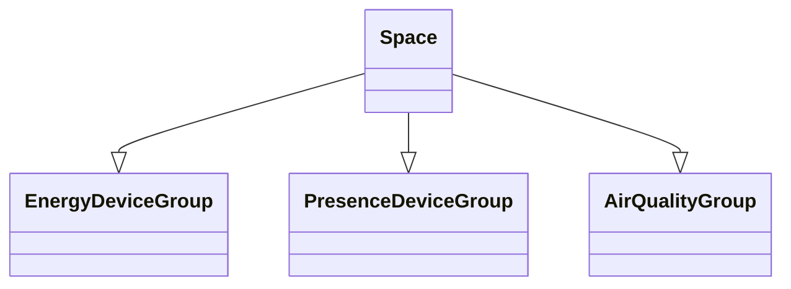

# Không gian

import Tabs from "@theme/Tabs";
import TabItem from "@theme/TabItem";

## Mô hình dữ liệu


## Mối quan hệ với các mô hình khác



<Tabs>
<TabItem value="service" label="API Service">

```typescript title="/src/app/services/space/space.service.ts"
import { HttpClient, HttpHeaders } from "@angular/common/http";
import { Injectable } from "@angular/core";
import { catchError, firstValueFrom, Observable, of } from "rxjs";
import { ApiResponse } from "src/app/models/api/api-response.model";
import { PaginationResponseModel } from "src/app/models/pagination/pagination.response.model";
import { SpaceSpaceInModelAssignmentPostModel } from "src/app/models/project/space/editor/space-space-in-model-assignment.post.model";
import { SpaceSpaceInModelAutoAssignmentPostModel } from "src/app/models/project/space/editor/space-space-in-model-auto-assignment.post.model";
import { SpaceType } from "src/app/models/space/space-type.enum";
import { Space } from "src/app/models/space/space.model";
import { SpacePostModel } from "src/app/models/space/space.post.model";
import { SpacePutModel } from "src/app/models/space/space.put.model";
import { SpaceResponseModel } from "src/app/models/space/space.response.model";
import { BaseService } from "../base/base.service";
import { ConfigService } from "../config/config.service";
import { ImageService } from "../image/image.service";
import { LoadingService } from "../loading/loading-service";
import { MessageService } from "../message/message.service";
import { Image } from "../../models/image/image.model";
import { AssetResponseModel } from "src/app/models/asset/asset.response.model";
import { Asset } from "src/app/models/asset/asset.model";
import { ProjectSpaceIoTGroupAssignmentPutModel } from "src/app/models/project/space/project-space-iot-group-assignment.put.model";
import { CacheManagerService } from "../cache-manager/cache-manager.service";
import { PaginationData } from "src/app/models/pagination/pagination-data.model";
import { Project_v2_Service } from "../project-v2/project-v2.service";

@Injectable()
export class SpaceService extends BaseService {

    constructor(
        private http: HttpClient
        , private messageService: MessageService
        , private loadingService: LoadingService
        , private configService: ConfigService
        , private imageService: ImageService
        , private cacheManagerService: CacheManagerService
        , private project_v2_Service: Project_v2_Service
    )
    {
        super();
        this.baseAddress = `[fmApi]/v1/[clientId]/[projectId]/spaces`;
        this.baseAssetAddress = `[fmApi]/v1/[clientId]/[projectId]/assets`;
    }

    public types: { type: SpaceType, name: string }[] = [
        { type: SpaceType.UNDEFINED, name: "-- UNDEFINED --" },
        { type: SpaceType.BALCONY, name: "BALCONY" },
        { type: SpaceType.CORRIDOR, name: "CORRIDOR" },
        { type: SpaceType.LEVEL, name: "LEVEL" },
        { type: SpaceType.ROAD, name: "ROAD" },
        { type: SpaceType.ROOM, name: "ROOM" },
        { type: SpaceType.SPACE, name: "SPACE" },
        { type: SpaceType.STAIR, name: "STAIR" },
        { type: SpaceType.TERRACE, name: "TERRACE" },
        { type: SpaceType.ZONE, name: "ZONE" },
    ];

    private baseAddress: string;
    private baseAssetAddress: string;
    private httpOptions = {
        headers: new HttpHeaders({
            'Content-Type': 'application/json'
        })
    };

    //public pageCache: PaginationModel<Space> = new PaginationModel();
    private _clearLocalCache()
    {
        this.cacheManagerService.clearLocalCacheWithNameIncluding(["/api/", "/spaces"]);
    }


    public async gets(
        pageIndex: number = 0,
        forceNew: boolean = false,
        loadingDivId: string = "",
        )
    {
        try
        {
            this.loadingService.show("", -1, loadingDivId);
            const response = await firstValueFrom(this.http.get<ApiResponse<PaginationResponseModel<SpaceResponseModel>>>(`${this.baseAddress}/page/${pageIndex}`
                , this.cacheManagerService.getLocalCacheHttpOptions(this.httpOptions.headers, 7 * 24 * 60, forceNew)
            )
            .pipe(
                catchError(this.handleError)
            ));
            this.loadingService.hide(loadingDivId);

            if(response.result)
            {
                const data = response.result.items.map(x => new Space(x, this.project_v2_Service.currentProject, this.configService.appConfig.CM_URL.URL));
                return new PaginationData(data, response.result.total);
            }
            else
            {
                this.messageService.setErrorMessage(response.errorMessage);
                return false;
            }
        }
        catch(err) {
            this.loadingService.hide(loadingDivId);
            console.error(err);
            this.messageService.setErrorMessage("Error: Can not connect to the server!");
            return false;
        }

    }

    public async getAllNoParents(
        forceNew: boolean = false,
        loadingDivId: string = "",
        )
    {
        try
        {
            if(!forceNew && this.project_v2_Service.currentProject && this.project_v2_Service.currentProject.space.orderedItems?.length > 0)
                return this.project_v2_Service.currentProject.space.orderedItems;

            this.loadingService.show("", -1, loadingDivId);
            const response = await firstValueFrom(this.http.get<ApiResponse<SpaceResponseModel[]>>(`${this.baseAddress}/all-no-parents`,
                this.cacheManagerService.getLocalCacheHttpOptions(this.httpOptions.headers, 7 * 24 * 60, forceNew)
            )
            .pipe(
                catchError(this.handleError)
            ));
            this.loadingService.hide(loadingDivId);
            if(response.result?.length > 0)
            {
                const items = response.result.map(x => new Space(x, this.project_v2_Service.currentProject, this.configService.appConfig.CM_URL.URL));
                if(this.project_v2_Service.currentProject)
                {
                    this.project_v2_Service.currentProject.space.set(items);
                    return this.project_v2_Service.currentProject.space.orderedItems;
                }

                return items;
            }
            else
            {
                this.messageService.setErrorMessage(response.errorMessage);
                return false;
            }
        }
        catch(err) {
            this.loadingService.hide(loadingDivId);
            console.error(err);
            this.messageService.setErrorMessage("Error: Can not connect to the server!");
            return false;
        }
    }

    public async getAllChildren(
        item: Space,
        forceNew: boolean = false,
        loadingDivId: string = ""
    )
    {
        try
        {
            if(item.children.isRetrieved) return item.children.items;

            this.loadingService.show("", -1, loadingDivId);
            const response = await firstValueFrom(this.http.get<ApiResponse<SpaceResponseModel[]>>(`${this.baseAddress}/children/${item.id}`,
                this.cacheManagerService.getLocalCacheHttpOptions(this.httpOptions.headers, 7 * 24 * 60, forceNew)
            )
            .pipe(
                catchError(this.handleError)
            ));
            this.loadingService.hide(loadingDivId);

            if(response.result)
            {
                if(response.result.length > 0)
                {
                    const items = response.result.map(x => new Space(x, item.project, this.configService.appConfig.CM_URL.URL));
                    items.forEach(x => {
                        x.parent = item;
                        x.level = item.level + 1
                    });
                    item.children.set(items);

                    return item.children.items;
                }

                item.children.set([]);
                return [];
            }
            else
            {
                this.messageService.setErrorMessage(response.errorMessage);
                return false;
            }
        }
        catch(err) {
            this.loadingService.hide(loadingDivId);
            console.error(err);
            this.messageService.setErrorMessage("Error: Can not connect to the server!");
            return false;
        }
    }

    public async get(
        spaceId: string,
        loadingDivId: string = ""
    )
    {
        try
        {
            if(this.project_v2_Service.currentProject)
            {
                const cache = this.project_v2_Service.currentProject.space.getByProp(spaceId, "id");
                if(cache)
                {
                    return cache;
                }
            }

            this.loadingService.show("", -1, loadingDivId);
            const response = await firstValueFrom(this.http.get<ApiResponse<SpaceResponseModel>>(`${this.baseAddress}/single-${spaceId}`,
                this.cacheManagerService.getLocalCacheHttpOptions(this.httpOptions.headers, 7 * 24 * 60)
            )
            .pipe(
                catchError(this.handleError)
            ));
            this.loadingService.hide(loadingDivId);

            if(response.result)
            {
                const item = new Space(response.result, this.project_v2_Service.currentProject, this.configService.appConfig.CM_URL.URL);
                if(this.project_v2_Service.currentProject) this.project_v2_Service.currentProject.space.add(item);
                return item;
            }
            else
            {
                this.messageService.setErrorMessage(response.errorMessage);
                return false;
            }
        }
        catch(err) {
            this.loadingService.hide(loadingDivId);
            console.error(err);
            this.messageService.setErrorMessage("Error: Can not connect to the server!");
            return false;
        }
    }

    public async post(
        model: SpacePostModel,
        loadingDivId: string = ""
    )
    {
        try
        {
            this.loadingService.show("", -1, loadingDivId);
            const response = await firstValueFrom(this.http.post<ApiResponse<SpaceResponseModel>>(`${this.baseAddress}`, model, this.httpOptions)
                .pipe(
                    catchError(this.handleError)
                ));
            this.loadingService.hide(loadingDivId);
            if(response?.result)
            {
                const item = new Space(response.result, this.project_v2_Service.currentProject, this.configService.appConfig.CM_URL.URL);
                this.project_v2_Service.currentProject?.space.add(item);
                this.messageService.setMessage("Successfully");
                this._clearLocalCache();
                return item;
            }
            else
            {
                this.messageService.setErrorMessage(response.errorMessage);
                return false;
            }
        }
        catch(err)
        {
            this.loadingService.hide(loadingDivId);
            console.error(err);
            this.messageService.setErrorMessage("Error: Can not connect to the server!");
            return false;
        }
    }


    public search(keyword: string): Observable<ApiResponse<SpaceResponseModel[]>>
    {
        this.messageService.clearMessage();
        if (!keyword?.trim()) {
            // if not search term, return empty hero array.
            return of(new ApiResponse<SpaceResponseModel[]>());
        }
        return this.http.get<ApiResponse<SpaceResponseModel[]>>(`${this.baseAddress}/search/${keyword.trim()}`,
            this.cacheManagerService.getLocalCacheHttpOptions(this.httpOptions.headers, 60)
        )
        .pipe(
            catchError(this.handleError)
        );
    }

    public async put(
        model: SpacePutModel
    )
    {
        try
        {
            this.loadingService.show("");
            const response = await firstValueFrom(this.http.put<ApiResponse<SpaceResponseModel>>(`${this.baseAddress}`, model, this.httpOptions)
                .pipe(
                    catchError(this.handleError)
                ));
            this.loadingService.hide();
            if(response?.result)
            {
                const item = new Space(response.result, this.project_v2_Service.currentProject, this.configService.appConfig.CM_URL.URL);
                //project?.space.addItem(item);
                this.project_v2_Service.currentProject?.space.add(item);
                this.project_v2_Service.currentProject?.space.processingParentAndChildren();
                this.messageService.setMessage("Successfully");

                this._clearLocalCache();

                return item;
            }
            else
            {
                this.messageService.setErrorMessage(response.errorMessage);
                return false;
            }
        }
        catch(err) {
            this.loadingService.hide();
            console.error(err);
            this.messageService.setErrorMessage("Error: Can not connect to the server!");
            return false;
        }
    }

    public async delete(
        id: string)
    {
        try
        {
            this.loadingService.show("");
            const response = await firstValueFrom(this.http.delete<ApiResponse<boolean>>(`${this.baseAddress}/${id}`, this.httpOptions)
                .pipe(
                    catchError(this.handleError)
                ));
            this.loadingService.hide();
            if(response?.result)
            {
                this.project_v2_Service.currentProject?.space.removeById(id);
                this.messageService.setMessage("successfully");

                this._clearLocalCache();

                return true;
            }
            else
            {
                this.messageService.setErrorMessage(response.errorMessage);
                return false;
            }
        }
        catch(err) {
            this.loadingService.hide();
            console.error(err);
            this.messageService.setErrorMessage("Error: Can not connect to the server!");
            return false;
        }
    }

    public async modelAssignments(models: SpaceSpaceInModelAssignmentPostModel[], loadingDivId: string = "")
    {
        try
        {
            this.loadingService.show("", -1, loadingDivId);
            const response = await firstValueFrom(this.http.put<ApiResponse<SpaceResponseModel[]>>(`${this.baseAddress}/model-assignments`, models, this.httpOptions)
                .pipe(
                    catchError(this.handleError)
                ));
            this.loadingService.hide(loadingDivId);
            if(response?.result)
            {
                this.messageService.setMessage("Successfully: " + response?.result.length);
                this._clearLocalCache();
                return response?.result;
            }
            else
            {
                this.messageService.setErrorMessage(response.errorMessage);
                return false;
            }
        }
        catch(err) {
            this.loadingService.hide(loadingDivId);
            console.error(err);
            this.messageService.setErrorMessage("Error: Can not connect to the server!");
            return false;
        }
    }

    public async modelAutoAssignments(models: SpaceSpaceInModelAutoAssignmentPostModel[], loadingDivId: string = "")
    {
        try
        {
            this.loadingService.show("", -1, loadingDivId);
            const response = await firstValueFrom(this.http.post<ApiResponse<boolean>>(`${this.baseAddress}/model-assignments`, models, this.httpOptions)
                .pipe(
                    catchError(this.handleError)
                ));
            this.loadingService.hide(loadingDivId);
            if(response?.result)
            {
                this.messageService.setMessage("Successfully");
                this._clearLocalCache();
                return true;
            }
            else
            {
                this.messageService.setErrorMessage(response.errorMessage);
                return false;
            }
        }
        catch(err) {
            this.loadingService.hide(loadingDivId);
            console.error(err);
            this.messageService.setErrorMessage("Error: Can not connect to the server!");
            return false;
        }
    }

    public async modelClearAllAssignments(loadingDivId: string = "")
    {
        try
        {
            this.loadingService.show("", -1, loadingDivId);
            const response = await firstValueFrom(this.http.delete<ApiResponse<SpaceResponseModel[]>>(`${this.baseAddress}/model-assignments`, this.httpOptions)
                .pipe(
                    catchError(this.handleError)
                ));
            this.loadingService.hide(loadingDivId);
            if(response?.result)
            {
                this.messageService.setMessage("Successfully: " + response?.result.length);
                this._clearLocalCache();
                return response?.result;
            }
            else
            {
                this.messageService.setErrorMessage(response.errorMessage);
                return false;
            }
        }
        catch(err) {
            this.loadingService.hide(loadingDivId);
            console.error(err);
            this.messageService.setErrorMessage("Error: Can not connect to the server!");
            return false;
        }
    }

    public async getImages(item: Space, loadingDivId: string = "")
    {
        if(item.image.isRetrieved) return true;

        this.messageService.clearMessage();
        try
        {
            const response = await this.imageService.getsByHostId(item.id, false, loadingDivId);
            if(response && response.length > 0)
            {
                const items = response.map(x => new Image(x, this.configService.appConfig.CM_URL.URL));
                item.image.set(items);
                item.processImageRootPaths(this.configService.appConfig.CM_URL.URL);
                return true;
            }
            else
            {
                item.image.set([]);
                return false;
            }
        }
        catch(err)
        {
            console.error(err);
            this.loadingService.hide(loadingDivId);
            this.messageService.setErrorMessage("Error: Can not connect to the server!");
            return false;
        }
    }

    public async getsAsset(
        item: Space,
        status: string = "all",
        system: string = "ALL",
        from: number = -1,
        to: number = -1,
        pageIndex: number = 0,
        forceNew: boolean = false,
        loadingDivId: string = ""
    )
    {
        try
        {
            if(status.includes("all")) status = "all";
            if(system.includes("ALL")) system = "ALL";

            this.loadingService.show("", -1, loadingDivId);
            const response = await firstValueFrom(this.http.get<ApiResponse<PaginationResponseModel<AssetResponseModel>>>(`${this.baseAssetAddress}/space-${item.id}/page-${pageIndex}/filter?from=${from}&status=${status}&system=${system}&to=${to}`
                , this.cacheManagerService.getLocalCacheHttpOptions(this.httpOptions.headers, 60, forceNew)
            )
            .pipe(
                catchError(this.handleError)
            ));
            this.loadingService.hide(loadingDivId);

            if (response.result)
            {
                const data = response.result.items.map(x => new Asset(x, this.configService.appConfig.CM_URL.URL));
                return new PaginationData(data, response.result.total);
            }
            else
            {
                this.messageService.setErrorMessage(response.errorMessage);
                return false;
            }
        }
        catch (err)
        {
            this.loadingService.hide(loadingDivId);
            console.error(err);
            this.messageService.setErrorMessage("Error: Can not connect to the server!");
            return false;
        }
    }

    public async deleteImage(
        item: Space,
        image: Image,
        loadingDivId: string = ""
    )
    {
        this.messageService.clearMessage();
        try
        {
            this.loadingService.show("", -1, loadingDivId);
            const response = await firstValueFrom(this.http.delete<ApiResponse<boolean>>(`${this.baseAddress}/images/${item.id}/${image.id}`, this.httpOptions)
                .pipe(
                    catchError(this.handleError)
                ));
            this.loadingService.hide(loadingDivId);

            if (response.result)
            {
                item.image.removeById(image.id);
                this.messageService.setMessage("Successfully!", 2222);
                return true;
            }
            else
            {
                this.messageService.setErrorMessage(response.errorMessage);
                return false;
            }
        }
        catch (err)
        {
            this.loadingService.hide(loadingDivId);
            console.error(err);
            this.messageService.setErrorMessage("Error: Can not connect to the server!");
            return false;
        }
    }

    public async setDefaultImage(
        item: Space,
        image: Image,
        loadingDivId: string = ""
    )
    {
        this.messageService.clearMessage();
        try
        {
            this.loadingService.show("", -1, loadingDivId);
            const response = await firstValueFrom(this.http.put<ApiResponse<boolean>>(`${this.baseAddress}/images/default/${item.id}/${image.id}`, this.httpOptions)
                .pipe(
                    catchError(this.handleError)
                ));
            this.loadingService.hide(loadingDivId);

            if (response.result)
            {
                item.imageRootPath = image.serverFileRootPath;
                item.imageRootPathUrl = image.originalImageSrc;
                this.messageService.setMessage("Successfully", 2222);
                this._clearLocalCache();
                return true;
            }
            else
            {
                this.messageService.setErrorMessage(response.errorMessage);
                return false;
            }
        }
        catch (err)
        {
            this.loadingService.hide(loadingDivId);
            console.error(err);
            this.messageService.setErrorMessage("Error: Can not connect to the server!");
            return false;
        }
    }

    //#region IoT

    //#region Group Assignment
    public async putIoTGroup(
        item: Space,
        model: ProjectSpaceIoTGroupAssignmentPutModel,
        loadingDivId: string = ""
    )
    {
        try
        {
            this.loadingService.show("", -1, loadingDivId);
            const response = await firstValueFrom(this.http.put<ApiResponse<SpaceResponseModel>>(`${this.baseAddress}/iot-groups`, model, this.httpOptions)
                .pipe(
                    catchError(this.handleError)
                ));
            this.loadingService.hide(loadingDivId);
            if(response?.result)
            {
                item.energyDeviceGroup = response.result.energyDeviceGroup;
                item.presenceDeviceGroup = response.result.presenceDeviceGroup;
                item.airQualityGroup = response.result.airQualityGroup;

                this.messageService.setMessage("Successfully");
                this._clearLocalCache();
                return item;
            }
            else
            {
                this.messageService.setErrorMessage(response.errorMessage);
                return false;
            }
        }
        catch(err) {
            this.loadingService.hide(loadingDivId);
            console.error(err);
            this.messageService.setErrorMessage("Error: Can not connect to the server!");
            return false;
        }
    }
    //#endregion

    //#endregion
}

```

</TabItem>

<TabItem value="html" label="Html">

```html title="/src/app/components/space/detail/space-v2-detail.component.html"
<div id="space-v2-detail" class="position-relative display-flex flex-direction-column" *ngIf="item">
    <mat-tab-group>
        <mat-tab label="Information">
            <ng-template matTabContent>
                <div class="display-flex padding-0p5rem">
                    <div class="image cursor-pointer" (click)="openImages()">
                        
                    </div>
                    <div class="mr-left-1rem col-eq display-flex flex-direction-column">
                        <app-space-v2-information [item]="item"></app-space-v2-information>
                    </div>
                </div>
            </ng-template>
        </mat-tab>
        <mat-tab label="Asset">
            <ng-template matTabContent>
                <app-space-v2-asset [item]="item"></app-space-v2-asset>
            </ng-template>
        </mat-tab>
        <mat-tab label="Report">
            <ng-template matTabContent>
                <app-space-v2-report [space]="item" [dateRange]="dateRange" [dateRangeAction]="dateRangeAction"></app-space-v2-report>
            </ng-template>
        </mat-tab>
        <mat-tab label="Image">
            <ng-template matTabContent>
                <app-space-v2-image-list [item]="item"></app-space-v2-image-list>
            </ng-template>
        </mat-tab>
    </mat-tab-group>
    <app-loading [id]="'space-v2-detail-loading'"></app-loading>
</div>

```

</TabItem>

<TabItem value="scss" label="Scss">

```scss title="/src/app/components/space/detail/space-v2-detail.component.scss"
#space-detail
{
    .image
    {
        width: 150px;
        height: 150px;
        border-radius: 5px;

        img {
            width: 100%;
            height: 100%;
            object-fit: cover;
            border-radius: inherit;
        }
    }

    .info
    {
        flex: 1;
        margin-left: 1rem;
    }
}

```

</TabItem>

<TabItem value="typescript" label="Typescript">

```typescript title="/src/app/components/space/detail/space-v2-detail.component.ts"
import { NgIf } from "@angular/common";
import { CUSTOM_ELEMENTS_SCHEMA, Component, Input } from "@angular/core";
import { MatTabsModule } from "@angular/material/tabs";
import { ChartRange } from "src/app/models/chart/chart-range.model";
import { InputAction } from "src/app/models/common/input-action.model";
import { StatTimeType } from "src/app/models/global/stat-time-type.enum";
import { Space } from "src/app/models/space/space.model";
import { ImageLightboxService } from "src/app/services/image-lightbox/image-lightbox.service";
import { MessageService } from "src/app/services/message/message.service";
import { SpaceService } from "src/app/services/space/space.service";
import { LoadingComponent } from "../../global/loading/loading.component";
import { ExpansionPanel2Component } from "../../shared/expansion-panel2/expansion-panel2.component";
import { SpaceInformationComponent_v2 } from "../information/space-v2-information.component";
import { SpaceAssetComponent_v2 } from "../asset/space-v2-asset.component";
import { SpaceImageListComponent_v2 } from "../image-list/space-v2-image-list.component";
import { SpaceReportComponent_v2 } from "../report/space-v2-report.component";

@Component({
    standalone: true,
    imports: [
        LoadingComponent,
        ExpansionPanel2Component,
        SpaceInformationComponent_v2,
        SpaceAssetComponent_v2,
        SpaceImageListComponent_v2,
        SpaceReportComponent_v2,

        NgIf,
        MatTabsModule,
    ],
    providers: [
        SpaceService
    ],
    schemas: [
        CUSTOM_ELEMENTS_SCHEMA
    ],
    selector: 'app-space-v2-detail',
    templateUrl: './space-v2-detail.component.html',
    styleUrls: ['./space-v2-detail.component.scss']
})

export class SpaceDetailComponent_v2
{
    @Input() item: Space | null = null;
    @Input() dateRange: ChartRange = new ChartRange(new Date(new Date().getTime() - 14 * 86400 * 1000), new Date(), StatTimeType.UNDEFINED);
    @Input() dateRangeAction: InputAction = new InputAction();
    @Input() loadingDivId: string = "space-v2-detail-loading";

    constructor(
        private spaceService: SpaceService
        , private imageLightboxService: ImageLightboxService
        , private messageService: MessageService
    )
    {

    }

    //#region Images
    public async getImages()
    {
        if (this.item)
        {
            await this.spaceService.getImages(this.item, this.loadingDivId);
        }
    }

    public async openImages()
    {
        if(this.item && this.item.imageRootPathUrl  && this.item.imageRootPathUrl.length > 1)
        {
            await this.spaceService.getImages(this.item);
        }

        if (this.item && this.item.image.items.length > 0)
        {
            this.imageLightboxService.set2(this.item.id, this.item.image.items, this.item.image.items[0].id);
        }
        else
        {
            this.messageService.setErrorMessage("No images!");
        }
    }
    //#endregion

}

```

</TabItem>

</Tabs>
