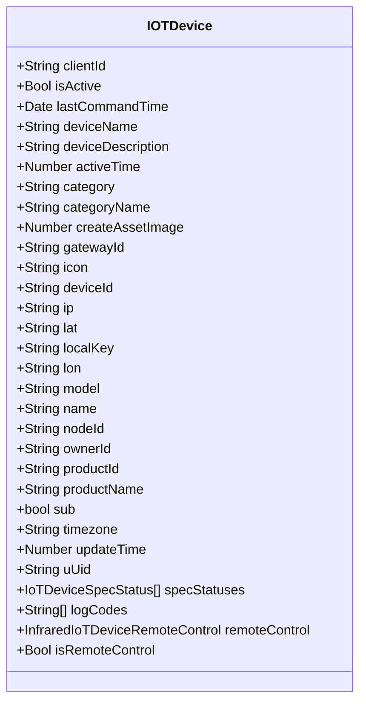
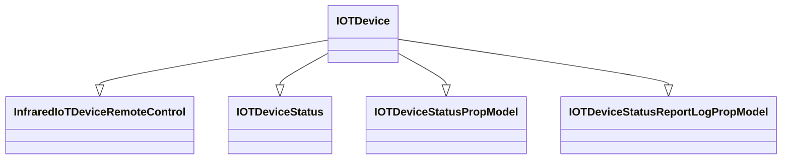

# IoT

import Tabs from "@theme/Tabs";
import TabItem from "@theme/TabItem";

## Mô hình dữ liệu


## Mối quan hệ với các mô hình khác



<Tabs>
<TabItem value="service" label="API Service">

```typescript title="/src/app/services/iot/iot.service.ts"
import { HttpClient, HttpHeaders } from "@angular/common/http";
import { Injectable } from "@angular/core";
import { firstValueFrom, Observable, of } from "rxjs";
import { catchError } from "rxjs/operators";
import { ApiResponse } from "src/app/models/api/api-response.model";
import { CachePropModel } from "src/app/models/cache/cache.prop.model";
import { IOTDeviceStatusModel } from "src/app/models/iot/iot-device-status-model.model";
import { IOTDeviceStatusModelResponseModel } from "src/app/models/iot/iot-device-status-model.response.model";
import { IOTDeviceStatusPropModel } from "src/app/models/iot/iot-device-status.prop.model";
import { IOTDevice } from "src/app/models/iot/iot-device.model";
import { IOTDevicePostModel } from "src/app/models/iot/iot-device.post.model";
import { IOTDevicePutModel } from "src/app/models/iot/iot-device.put.model";
import { IOTDeviceResponseModel } from "src/app/models/iot/iot-device.response.model";
import { InfraredIoTDeviceRemoteControl } from "src/app/models/iot/infrared-iot-device-remote-control.model";
import { InfraredIoTDeviceRemoteControlResponseModel } from "src/app/models/iot/infrared-iot-device-remote-control.response.model";
import { PaginationResponseModel } from "src/app/models/pagination/pagination.response.model";
import { ProjectIOTResponseModel } from "src/app/models/project/iot/project-iot.response.model";
import { BaseService } from "../base/base.service";
import { LoadingService } from "../loading/loading-service";
import { MessageService } from "../message/message.service";
import { InfraredIoTDeviceRemoteControlPostModel } from "src/app/models/iot/infrared-iot-device-remote-control.post.model";
import { CacheManagerService } from "../cache-manager/cache-manager.service";
import { PaginationData } from "src/app/models/pagination/pagination-data.model";
import { StateService } from "../state/state.service";

@Injectable()
export class IOTService extends BaseService
{
    constructor(
        private http: HttpClient
        , private loadingService: LoadingService
        , private messageService: MessageService
        , private cacheManagerService: CacheManagerService
        , private stateService: StateService
    )
    {
        super();
        //console.log("IOTService constructor");
        this.baseAddress = "[fmApi]/v1/[clientId]/iots";
        this.baseAddressProject = "[fmApi]/v1/[clientId]/[projectId]/iots";
    }

    private baseAddressProject: string;
    private baseAddress: string;

    private httpOptions = {
        headers: new HttpHeaders({
            'Content-Type': 'application/json'
        })
    };

    private _clearLocalCache(withRoute: string = "")
    {
        if(withRoute && withRoute.length > 0)
        {
            this.cacheManagerService.clearLocalCacheWithNameIncluding(["/api/", "/iots", withRoute]);
        }
        else
        {
            this.cacheManagerService.clearLocalCacheWithNameIncluding(["/api/", "/iots"]);
        }
    }

    public search(keyword: string, category: string): Observable<ApiResponse<IOTDeviceResponseModel[]>> {
        if (!keyword.trim() || keyword.trim().length < 3) {
            // if not search term, return empty hero array.
            return of(new ApiResponse<IOTDeviceResponseModel[]>());
        }

        return this.http.get<ApiResponse<IOTDeviceResponseModel[]>>(`${this.baseAddress}/search/${keyword.trim()}/cat-${category}`, this.httpOptions)
            .pipe(
                catchError(this.handleError)
            );
    }

    public searchWithProject(keyword: string): Observable<ApiResponse<ProjectIOTResponseModel[]>> {
        if (!keyword.trim() || keyword.trim().length < 3) {
            // if not search term, return empty hero array.
            return of(new ApiResponse<ProjectIOTResponseModel[]>());
        }

        return this.http.get<ApiResponse<ProjectIOTResponseModel[]>>(`${this.baseAddressProject}/search/${keyword.trim()}`, this.httpOptions)
            .pipe(
                catchError(this.handleError)
            );
    }

    private _cache: CachePropModel<IOTDevice> = new CachePropModel();
    public get cache()
    {
        return this._cache;
    }

    public async get(
        id: string
        , loadingDivId: string = ""
    )
    {
        this.messageService.clearMessage();
        try
        {
            const cache = this._cache.cache.get(id);
            if(cache) return cache;

            this.loadingService.show("", -1, loadingDivId);
            const response = await firstValueFrom(this.http.get<ApiResponse<IOTDeviceResponseModel>>(`${this.baseAddress}/${id}`, this.httpOptions)
            .pipe(
                catchError(this.handleError)
            ));
            this.loadingService.hide(loadingDivId);

            if(response?.result)
            {
                const item = new IOTDevice(response.result);
                this._cache.add(item);
                return item;
            }
            else
            {
                this.messageService.setErrorMessage(response.errorMessage);
                return false;
            }
        }
        catch(err) {
            console.error(err);
            this.loadingService.hide(loadingDivId);
            this.messageService.setErrorMessage("Error: Can not connect to the server!");
            return false;
        }
    }

    // public async gets(
    //     pageIndex: number,
    //     loadingDivId: string = ""
    // )
    // {
    //     try
    //     {
    //         const cache = this._cache.page.get(pageIndex);
    //         if(cache) return cache.items;

    //         this.loadingService.show("", -1, loadingDivId);
    //         const response = await firstValueFrom(this.http.get<ApiResponse<PaginationResponseModel<IOTDeviceResponseModel>>>(`${this.baseAddress}/page-${pageIndex}`, this.httpOptions)
    //         .pipe(
    //             catchError(this.handleError)
    //         ));
    //         this.loadingService.hide(loadingDivId);

    //         if(response?.result)
    //         {
    //             this._cache.page.total = response.result.total;
    //             const items = response.result?.items?.map(x => new IOTDevice(x));
    //             this._cache.page.addPageByItems(items, pageIndex);
    //             return items;
    //         }
    //         else
    //         {
    //             this.messageService.setErrorMessage(response.errorMessage);
    //             return false;
    //         }
    //     }
    //     catch(err) {
    //         console.error(err);
    //         this.loadingService.hide(loadingDivId);
    //         this.messageService.setErrorMessage("Error: Can not connect to the server!");
    //         return false;
    //     }
    // }

    public async gets(
        keyword: string,
        category: string,
        pageIndex: number,
        forceNew: boolean = false,
        loadingDivId: string = ""
    )
    {
        try
        {
            this.loadingService.show("", -1, loadingDivId);
            const response = await firstValueFrom(this.http.get<ApiResponse<PaginationResponseModel<IOTDeviceResponseModel>>>(`${this.baseAddress}?cat=${category}&page=${pageIndex}&text=${keyword}`
                , this.cacheManagerService.getLocalCacheHttpOptions(this.httpOptions.headers, 24 * 60, forceNew)
            )
            .pipe(
                catchError(this.handleError)
            ));
            this.loadingService.hide(loadingDivId);

            if(response?.result)
            {
                if(response.result.items && response.result.items.length > 0)
                {
                    const items = response.result?.items?.map(x => new IOTDevice(x));
                    return new PaginationData(items, response.result.total);
                }
                return new PaginationData([], response.result.total);
            }
            else
            {
                this.messageService.setErrorMessage(response.errorMessage);
                return false;
            }
        }
        catch(err) {
            console.error(err);
            this.loadingService.hide(loadingDivId);
            this.messageService.setErrorMessage("Error: Can not connect to the server!");
            return false;
        }
    }

    public async getStatus(item: IOTDevice, days: number, loadingDivId: string = "")
    {
        this.messageService.clearMessage();
        try
        {
            if(item.status.isExpired())
            {
                this.loadingService.show("", -1, loadingDivId);
                const response = await firstValueFrom(this.http.get<ApiResponse<IOTDeviceStatusModelResponseModel[]>>(`${this.baseAddress}/statuses/${item.id}/${days}`, this.httpOptions)
                .pipe(
                    catchError(this.handleError)
                ));
                this.loadingService.hide(loadingDivId);

                if(response?.result && response.result?.length > 0)
                {
                    item.status = new IOTDeviceStatusPropModel();
                    const status = response?.result?.map(x => new IOTDeviceStatusModel(x))?.sort((a, b) => b.firstDate?.getTime() - a.firstDate?.getTime());
                    item.status.set(status, item.category);
                    this._cache.add(item);
                    return item;
                }
                else
                {
                    //this.messageService.setErrorMessage(response.errorMessage ? response.errorMessage : "No status!");
                    return false;
                }
            }
            else return item;
        }
        catch(err) {
            console.error(err);
            this.loadingService.hide(loadingDivId);
            this.messageService.setErrorMessage("Error: Can not connect to the server!");
            return false;
        }
    }

    public async getStatusByItemId(iotDeviceId: string, days: number)
    {
        this.messageService.clearMessage();
        try
        {
            this.loadingService.show();
            const response = await firstValueFrom(this.http.get<ApiResponse<IOTDeviceStatusModelResponseModel[]>>(`${this.baseAddress}/statuses/${iotDeviceId}/${days}`, this.httpOptions)
            .pipe(
                catchError(this.handleError)
            ));
            this.loadingService.hide();

            if(response?.result && response.result?.length > 0)
            {
                const status = response?.result?.map(x => new IOTDeviceStatusModel(x))?.sort((a, b) => b.firstDate?.getTime() - a.firstDate?.getTime());
                return status;
            }
            else
            {
                //this.messageService.setErrorMessage(response.errorMessage ? response.errorMessage : "No status!");
                return false;
            }
        }
        catch(err) {
            console.error(err);
            this.loadingService.hide();
            this.messageService.setErrorMessage("Error: Can not connect to the server!");
            return false;
        }
    }

    public async post(model: IOTDevicePostModel, loadingDivId: string = "")
    {
        this.messageService.clearMessage();
        try
        {
            this.loadingService.show("", -1, loadingDivId);
            const response = await firstValueFrom(this.http.post<ApiResponse<IOTDeviceResponseModel>>(`${this.baseAddress}`, model, this.httpOptions)
            .pipe(
                catchError(this.handleError)
            ));
            this.loadingService.hide(loadingDivId);

            if(response?.result)
            {
                const item = new IOTDevice(response.result);
                this.messageService.setMessage("A new device has been created successfully!");
                this._clearLocalCache();
                this.stateService.nextIoTDevice(item);
                return item;
            }
            else
            {
                this.messageService.setErrorMessage(response.errorMessage);
                return false;
            }
        }
        catch(err) {
            console.error(err);
            this.loadingService.hide(loadingDivId);
            this.messageService.setErrorMessage("Error: Can not connect to the server!");
            return false;
        }
    }

    public async put(item: IOTDevice, model: IOTDevicePutModel, loadingDivId: string = "")
    {
        this.messageService.clearMessage();
        try
        {
            this.loadingService.show("", -1, loadingDivId);
            const response = await firstValueFrom(this.http.put<ApiResponse<IOTDeviceResponseModel>>(`${this.baseAddress}`, model, this.httpOptions)
            .pipe(
                catchError(this.handleError)
            ));
            this.loadingService.hide(loadingDivId);

            if(response?.result)
            {
                item.gatewayId = response.result.gatewayId;
                item.logCodes = response.result.logCodes;
                item.deviceId = response.result.deviceId;
                item.deviceDescription = response.result.deviceDescription;
                item.deviceName = response.result.deviceName;
                this.messageService.setMessage("A device has been updated successfully!");
                this._cache.add(item);
                return item;
            }
            else
            {
                this.messageService.setErrorMessage(response.errorMessage);
                return false;
            }
        }
        catch(err) {
            console.error(err);
            this.loadingService.hide(loadingDivId);
            this.messageService.setErrorMessage("Error: Can not connect to the server!");
            return false;
        }
    }

    public async getStreamingAddress(item: IOTDevice, loadingDivId: string = "")
    {
        this.messageService.clearMessage();
        try
        {
            this.loadingService.show("", -1, loadingDivId);
            const response = await firstValueFrom(this.http.get<ApiResponse<string>>(`${this.baseAddress}/streaming/${item.id}`, this.httpOptions)
            .pipe(
                catchError(this.handleError)
            ));
            this.loadingService.hide(loadingDivId);

            if(response?.result && response.result?.length > 0)
            {
                item.streamingAddress = response.result;
                return item;
            }
            else
            {
                this.messageService.setErrorMessage(response.errorMessage ? response.errorMessage : "Can not stream video!");
                return false;
            }
        }
        catch(err) {
            console.error(err);
            this.loadingService.hide(loadingDivId);
            this.messageService.setErrorMessage("Error: Can not connect to the server!");
            return false;
        }
    }

    public async getStreamingAddressById(id: string, spinnerName: string)
    {
        this.messageService.clearMessage();
        try
        {
            this.loadingService.show();
            const response = await firstValueFrom(this.http.get<ApiResponse<string>>(`${this.baseAddress}/streaming/${id}`, this.httpOptions)
            .pipe(
                catchError(this.handleError)
            ));
            this.loadingService.hide();

            if(response?.result && response.result?.length > 0)
            {
                return response.result;
            }
            else
            {
                this.messageService.setErrorMessage(response.errorMessage ? response.errorMessage : "Can not stream video!");
                return false;
            }
        }
        catch(err) {
            console.error(err);
            this.loadingService.hide();
            this.messageService.setErrorMessage("Error: Can not connect to the server!");
            return false;
        }
    }

    public async activate(item: IOTDevice, loadingDivId: string = "")
    {
        this.messageService.clearMessage();
        try
        {
            this.loadingService.show("", -1, loadingDivId);
            const response = await firstValueFrom(this.http.put<ApiResponse<IOTDeviceResponseModel>>(`${this.baseAddress}/activations/${item.id}`, this.httpOptions)
            .pipe(
                catchError(this.handleError)
            ));
            this.loadingService.hide(loadingDivId);

            if(response?.result)
            {
                item.isActive = response.result.isActive;
                this.messageService.setMessage("A device has been updated successfully!");
                this._clearLocalCache();
                this.stateService.nextIoTDevice(item);
                return true;
            }
            else
            {
                this.messageService.setErrorMessage(response.errorMessage);
                return false;
            }
        }
        catch(err) {
            console.error(err);
            this.loadingService.hide(loadingDivId);
            this.messageService.setErrorMessage("Error: Can not connect to the server!");
            return false;
        }
    }

    //#region Infrared Devices
    public async getRemoteControlList(
        iotDeviceId: string,
        forceNew: boolean = false,
        loadingDivId: string = ""
    )
    {
        this.messageService.clearMessage();
        try
        {
            this.loadingService.show("", -1, loadingDivId);
            const response = await firstValueFrom(this.http.get<ApiResponse<InfraredIoTDeviceRemoteControlResponseModel[]>>(`${this.baseAddress}/infrared/remote-controls/${iotDeviceId}`
                , this.cacheManagerService.getLocalCacheHttpOptions(this.httpOptions.headers, 24 * 60, forceNew)
            )
            .pipe(
                catchError(this.handleError)
            ));
            this.loadingService.hide(loadingDivId);

            if(response?.result)
            {
                const items = response.result.map(x => new InfraredIoTDeviceRemoteControl(x));
                return items;
            }
            else
            {
                this.messageService.setErrorMessage(response.errorMessage);
                return false;
            }
        }
        catch(err) {
            console.error(err);
            this.loadingService.hide(loadingDivId);
            this.messageService.setErrorMessage("Error: Can not connect to the server!");
            return false;
        }
    }

    public async postRemoteControl(model: InfraredIoTDeviceRemoteControlPostModel, loadingDivId: string = "")
    {
        this.messageService.clearMessage();
        try
        {
            this.loadingService.show("", -1, loadingDivId);
            const response = await firstValueFrom(this.http.post<ApiResponse<IOTDeviceResponseModel[]>>(`${this.baseAddress}/infrared/remote-controls`, model, this.httpOptions)
            .pipe(
                catchError(this.handleError)
            ));
            this.loadingService.hide(loadingDivId);

            if(response?.result)
            {
                if(response.result.length > 0)
                {
                    const items = response.result.map(x => new IOTDevice(x));
                    this.messageService.setMessage("Created Remotes: " + items.length);
                    this._clearLocalCache("/infrared/remote-controls/");
                    return items;
                }
                this.messageService.setMessage("No created remotes!");
                return [];
            }
            else
            {
                this.messageService.setErrorMessage(response.errorMessage);
                return false;
            }
        }
        catch(err) {
            console.error(err);
            this.loadingService.hide(loadingDivId);
            this.messageService.setErrorMessage("Error: Can not connect to the server!");
            return false;
        }
    }
    //#endregion

}

```

</TabItem>

<TabItem value="html" label="Html">

```html title="/src/app/components/iot/detail/iot-device-detail.component.html"
<div *ngIf="item !== null;" id="iot-device-detail" class="display-flex flex-direction-column">
    <div class="content-title">IOT DEVICE: {{ item.deviceName }}</div>
    <div class="item display-flex align-items-center min-height-1p5rem">
        <div class="left">Name</div>
        <div class="right text-ellipsis">{{ item.deviceName }}</div>
    </div>
    <div class="item display-flex align-items-center min-height-1p5rem">
        <div class="left">Description</div>
        <div class="right text-ellipsis" title="{{ item.deviceDescription }}">{{ item.deviceDescription }}</div>
    </div>
    <div class="item display-flex align-items-center min-height-1p5rem">
        <div class="left">First User</div>
        <div class="right text-ellipsis">
            <app-display-email [emails]="[item.firstUserEmail]" [isKeepEmailDomain]="true"></app-display-email>
        </div>
    </div>
    <div class="min-height-1p5rem">
    </div>
    <div class="item display-flex align-items-center min-height-1p5rem">
        <div class="left">Id</div>
        <div class="right text-ellipsis">{{ item.deviceId }}</div>
    </div>
    <div class="item display-flex align-items-center min-height-1p5rem">
        <div class="left">Name</div>
        <div class="right text-ellipsis">{{ item.name }}</div>
    </div>
    <div class="item display-flex align-items-center min-height-1p5rem">
        <div class="left">Active Time</div>
        <div class="right text-ellipsis">{{ item.activeDate | date: 'dd/MM/yy HH:mm' }}</div>
    </div>
    <div class="item display-flex align-items-center min-height-1p5rem">
        <div class="left">Category</div>
        <div class="right text-ellipsis">{{ item.category }}</div>
    </div>
    <div class="item display-flex align-items-center min-height-1p5rem">
        <div class="left">Category Name</div>
        <div class="right text-ellipsis">{{ item.categoryName }}</div>
    </div>
    <div class="item display-flex align-items-center min-height-1p5rem">
        <div class="left">Create Time</div>
        <div class="right text-ellipsis">{{ item.createDate | date: 'dd/MM/yy HH:mm' }}</div>
    </div>
    <div class="item display-flex align-items-center min-height-1p5rem">
        <div class="left">Gateway Id</div>
        <div class="right text-ellipsis">{{ item.gatewayId }}</div>
    </div>
    <div class="item display-flex align-items-center min-height-1p5rem">
        <div class="left">Ip</div>
        <div class="right text-ellipsis">{{ item.ip }}</div>
    </div>
    <div class="item display-flex align-items-center min-height-1p5rem">
        <div class="left">Model</div>
        <div class="right text-ellipsis">{{ item.model }}</div>
    </div>
    <div class="item display-flex align-items-center min-height-1p5rem">
        <div class="left">Product</div>
        <div class="right text-ellipsis">{{ item.productName }}</div>
    </div>
    <ng-container *ngIf="item.remoteControl && item.remoteControl.keys && item.remoteControl.keys.length > 0;">
        <div class="font-weight-bold mr-top-1rem min-height-2rem display-flex align-items-center justify-content-center">
            REMOTE CONTROL KEYS
        </div>
        <div class="display-flex flex-wrap-wrap">
            <ng-container *ngFor="let key of item.remoteControl.keys">
                <div class="mr-right-0p5rem display-flex align-items-center padding-0p5rem border-solid-global justify-content-center">{{ key.keyName }}</div>
            </ng-container>
        </div>
    </ng-container>
</div>

```

</TabItem>

<TabItem value="scss" label="Scss">

```scss title="/src/app/components/iot/detail/iot-device-detail.component.scss"
#iot-device-detail
{
    min-width: 360px;
    .item
    {
        border-bottom: dashed 1px rgba(0, 0, 0, 0.3);
    }
    .left
    {
        flex: 0 0 100px;
    }

    .right
    {
        flex: 0 0 calc(100% - 100px);
    }
}

```

</TabItem>

<TabItem value="typescript" label="Typescript">

```typescript title="/src/app/components/iot/detail/iot-device-detail.component.ts"
import { Component, Input } from "@angular/core";
import { IOTDevice } from "src/app/models/iot/iot-device.model";
import { DisplayEmailComponent } from "../../shared/display-email/display-email.component";
import { DatePipe, NgFor, NgIf } from "@angular/common";

@Component({
    standalone: true,
    imports: [
        DisplayEmailComponent,

        NgIf, NgFor,
        DatePipe,
    ],
    selector: 'app-iot-device-detail',
    templateUrl: './iot-device-detail.component.html',
    styleUrls: ['./iot-device-detail.component.scss']
})

export class IOTDeviceDetailComponent
{
    @Input() item: IOTDevice | null = null;
}

```

</TabItem>

</Tabs>

