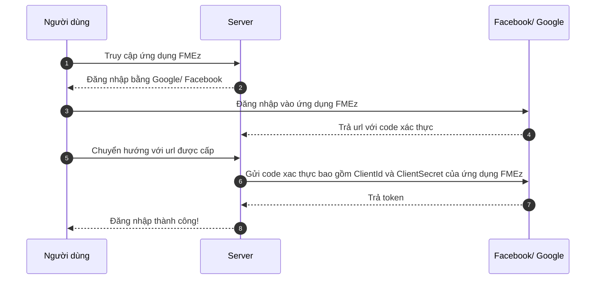

# Xác thực

## Hình thức

Xác thực trong ứng dụng gồm 3 hình thức:

- Đăng nhập với tài khoản đã đăng ký.
- Đăng nhập bằng tài khoản Google (xác thực 2 lớp: mật khẩu và điện thoại) tiêu chuẩn Oauth2.
- Đăng nhập bằng tài khoản Microsoft (xác thực 2 lớp: mật khẩu và điện thoại) tiêu chuẩn Oauth2.

## Tiêu chuẩn Oauth2



import Tabs from "@theme/Tabs";
import TabItem from "@theme/TabItem";

<Tabs>
<TabItem value="service" label="API Service">

```typescript title="/src/api/AuthenticateService.ts"
import AsyncStorage from "@react-native-async-storage/async-storage";
import { CFCToken } from "../model/authenticate/CFCToken";
import { ChangePasswordPutModel } from "../model/authenticate/ChangePasswordPutModel";
import { GoogleSignInResponse } from "../model/authenticate/GoogleSignInResponse";
import { MicrosoftCompleteSignInPostModel } from "../model/authenticate/MicrosoftCompleteSignInPostModel";
import { TokenRequestModel } from "../model/authenticate/TokenRequestModel";
import { ApiResponse } from "../model/base/ApiResponseModel";
import { HttpService } from "./HttpService";
import { ProfileResponseModel } from "../model/profiles/ProfileResponseModel";

class AuthenticateApi extends HttpService {
  constructor() {
    super();
    this.baseurl = this.publicIdApiUrl;
  }
  NormalLogin = async (loginModel: TokenRequestModel) => {
    const res = await this.Post(
      "/api/id/v1/authentications/login/mobile-app",
      loginModel
    );
    if (res.status !== 200) {
      let result = new ApiResponse<CFCToken>();
      result.statusCode = res.status;
      return result;
    }
    const json: ApiResponse<CFCToken> = await res.json();
    if (json && json.result) {
      await AsyncStorage.setItem("token", json.result.accessToken!);
      await AsyncStorage.setItem("refresh-token", json.result.refreshToken!);
      await AsyncStorage.setItem("cfc-token", JSON.stringify(json.result));
    }
    return json;
  };
  MicrosoftLogin = async (stateCode: string, email: string) => {
    let model = new MicrosoftCompleteSignInPostModel(stateCode, email);
    console.log(model);
    const res = await this.Post(
      `/api/id/v1/authentications/microsoft-signin-fm-mobile-app`,
      model
    );
    if (res.status !== 200) {
      let result = new ApiResponse<CFCToken>();
      result.statusCode = res.status;
      return result;
    }
    const json: ApiResponse<CFCToken> = await res.json();
    if (json && json.result) {
      await AsyncStorage.setItem("token", json.result.accessToken!);
      await AsyncStorage.setItem("refresh-token", json.result.refreshToken!);
      await AsyncStorage.setItem("cfc-token", JSON.stringify(json.result));
    }
    return json;
  };
  GetMicrosoftAuthenticateUrl = async () => {
    return `${this.publicIdApiUrl}/external/microsoft-signin-fm-mobile-app`;
  };
  GetNewToken = async () => {
    let model = new TokenRequestModel();
    model.refreshToken = (await this.GetRefreshToken())!;
    const res = await this.Post(
      `/api/id/v1/authentications/login/mobile-app`,
      model
    );
    console.log(res);
    if (res.status !== 200) {
      let result = new ApiResponse<CFCToken>();
      result.statusCode = res.status;
      return result;
    }
    const json: ApiResponse<CFCToken> = await res.json();
    if (json && json.result) {
      await AsyncStorage.setItem("token", json.result.accessToken!);
      await AsyncStorage.setItem("refresh-token", json.result.refreshToken!);
      await AsyncStorage.setItem("cfc-token", JSON.stringify(json.result));
    }
    return json;
  };
  ChangePassword = async (model: ChangePasswordPutModel) => {
    const res = await this.Put(
      `/api/id/v1/my-accounts/fm-change-password`,
      model
    );
    if (res.status !== 200) {
      let result = new ApiResponse<boolean>();
      result.statusCode = res.status;
      return result;
    }
    const json: ApiResponse<boolean> = await res.json();
    return json;
  };

  GoogleLoginIOS = async (model: GoogleSignInResponse) => {
    const res = await this.Post(
      `/api/id/v1/authentications/google/fm-ios`,
      model
    );
    if (res.status !== 200) {
      let result = new ApiResponse<CFCToken>();
      result.statusCode = res.status;
      return result;
    }
    const json: ApiResponse<CFCToken> = await res.json();
    if (json && json.result) {
      await AsyncStorage.setItem("token", json.result.accessToken!);
      await AsyncStorage.setItem("refresh-token", json.result.refreshToken!);
      await AsyncStorage.setItem("cfc-token", JSON.stringify(json.result));
    }
    return json;
  };
  GoogleLoginAndroid = async (model: GoogleSignInResponse) => {
    const res = await this.Post(
      `/api/id/v1/authentications/google/fm-android`,
      model
    );
    if (res.status !== 200) {
      let result = new ApiResponse<CFCToken>();
      result.statusCode = res.status;
      return result;
    }
    const json: ApiResponse<CFCToken> = await res.json();
    if (json && json.result) {
      await AsyncStorage.setItem("token", json.result.accessToken!);
      await AsyncStorage.setItem("refresh-token", json.result.refreshToken!);
      await AsyncStorage.setItem("cfc-token", JSON.stringify(json.result));
    }
    return json;
  };
  LinkGoogleIOS = async (model: GoogleSignInResponse) => {
    const res = await this.Post(
      `/api/id/v1/my-accounts/links/google-ios`,
      model
    );
    if (res.status !== 200) {
      let result = new ApiResponse<ProfileResponseModel>();
      result.statusCode = res.status;
      return result;
    }
    const json: ApiResponse<ProfileResponseModel> = await res.json();
    return json;
  };
  LinkGoogleAndroid = async (model: GoogleSignInResponse) => {
    const res = await this.Post(`/api/id/v1/my-accounts/links/google`, model);
    if (res.status !== 200) {
      let result = new ApiResponse<ProfileResponseModel>();
      result.statusCode = res.status;
      return result;
    }
    const json: ApiResponse<ProfileResponseModel> = await res.json();
    return json;
  };
  Profiles = async () => {
    const res = await this.Get("/api/id/v1/my-accounts/profiles");
    if (res.status !== 200) {
      let result = new ApiResponse<ProfileResponseModel>();
      result.statusCode = res.status;
      return result;
    }
    const json: ApiResponse<ProfileResponseModel> = await res.json();
    return json;
  };
  Logout = async () => {
    const res = await this.Post(`/api/id/v1/my-accounts/logout-fm-mobile`);
    if (res.status !== 200) {
      let result = new ApiResponse<boolean>();
      result.statusCode = res.status;
      return result;
    }
    const json: ApiResponse<boolean> = await res.json();
    return json;
  };
}
const authenticateApi = new AuthenticateApi();
export default authenticateApi;
```

</TabItem>

<TabItem value="typescript" label="Component">

```typescript title="/src/components/login/Login.tsx"
export default function Login(props: LoginProps) {
  //#region Normal Login
  const NormalLogin = async () => {
    globalContext.setShowSpinner(true);
    let res = await authenticateApi.NormalLogin(loginModel);
    globalContext.setShowSpinner(false);
    if (res.successful) {
      if (res.result) {
        await RegisterFirebaseToken();
        dispatch(SetUser(res.result));
        let profileRes = await authenticateApi.Profiles();
        if (profileRes.successful && profileRes.result) {
          dispatch(SetProfile(profileRes.result));
        }
        navigationToHome();
      } else {
        globalContext.openSnackbar(res.errorMessage);
      }
    } else {
      globalContext.openSnackbar(`Normal login: ${res.statusCode.toString()}`);
    }
  };
  //#endregion

  //#region Microsoft Login
  const LoginByMicrosoftEmail = async () => {
    let url = await authenticateApi.GetMicrosoftAuthenticateUrl();
    NavigationContainerRef.navigate("AuthenticateEmbbededBrowser", {
      url: url,
    });
  };
  const MicrosoftLogin = async () => {
    if (props.route.params.email && props.route.params.state) {
      globalContext.setShowSpinner(true);

      let res = await authenticateApi.MicrosoftLogin(
        props.route.params.state,
        props.route.params.email
      );
      globalContext.setShowSpinner(false);

      if (res.successful) {
        if (res && res.result) {
          await RegisterFirebaseToken();
          dispatch(SetUser(res.result));
          let profileRes = await authenticateApi.Profiles();
          if (profileRes.successful && profileRes.result) {
            dispatch(SetProfile(profileRes.result));
          }
          navigationToHome();
        } else {
          globalContext.openSnackbar(res.errorMessage);
        }
      } else {
        globalContext.openSnackbar(
          `Microsoft login: ${res.statusCode.toString()}`
        );
      }
    }
  };
  //#endregion

  //#region Google Login
  const GoogleLogin = async () => {
    const isSignedIn = await GoogleSignin.isSignedIn();
    if (isSignedIn) {
      console.log("signed in");
      // await GoogleSignin.revokeAccess();
      // await GoogleSignin.getTokens();

      await GoogleSignin.signOut();
    }
    // else {
    const userInfo = await GetGoogleUserInfo();
    if (userInfo) {
      let model = new GoogleSignInResponse();
      model.clientId = Platform.OS === "ios" ? "" : "";
      model.credential = userInfo.idToken!;
      globalContext.setShowSpinner(true);

      let res =
        Platform.OS === "ios"
          ? await authenticateApi.GoogleLoginIOS(model)
          : await authenticateApi.GoogleLoginAndroid(model);
      globalContext.setShowSpinner(false);
      if (res.successful) {
        if (res && res.result) {
          await RegisterFirebaseToken();
          dispatch(SetUser(res.result));
          let profileRes = await authenticateApi.Profiles();
          if (profileRes.successful && profileRes.result) {
            dispatch(SetProfile(profileRes.result));
          }
          navigationToHome();
        } else {
          globalContext.openSnackbar(res.errorMessage);
        }
      } else {
        globalContext.openSnackbar(
          `Google login: ${res.statusCode.toString()}`
        );
      }
    }
    // }
  };
  const GetGoogleUserInfo = async () => {
    try {
      await GoogleSignin.hasPlayServices();
      // const oldInfo = await GoogleSignin.getCurrentUser();

      const user = await GoogleSignin.getCurrentUser();
      if (user?.idToken) {
        await GoogleSignin.clearCachedAccessToken(user.idToken);
      }
      // if (oldInfo) {
      //   const oldTokens = await GoogleSignin.getTokens();
      //   await GoogleSignin.clearCachedAccessToken(oldTokens.accessToken);
      // }
      const userInfo = await GoogleSignin.signIn();
      // const tokens = await GoogleSignin.getTokens();
      // userInfo.idToken = tokens.accessToken;
      // console.log(tokens)
      return userInfo;
    } catch (error: any) {
      console.log(error);
      if (error.code === statusCodes.SIGN_IN_CANCELLED) {
        // user cancelled the login flow
      } else if (error.code === statusCodes.IN_PROGRESS) {
        // operation (e.g. sign in) is in progress already
      } else if (error.code === statusCodes.PLAY_SERVICES_NOT_AVAILABLE) {
        // play services not available or outdated
      } else {
        // some other error happened
      }
    }
  };
  //#endregion

  //#region Apple Login
  const AppleLogin = async () => {
    // performs login request
    const appleAuthRequestResponse = await appleAuth.performRequest({
      requestedOperation: appleAuth.Operation.LOGIN,
      // Note: it appears putting FULL_NAME first is important, see issue #293
      requestedScopes: [appleAuth.Scope.FULL_NAME, appleAuth.Scope.EMAIL],
    });
    if (appleAuthRequestResponse) {
      navigationToHome();
    }
    console.log(appleAuthRequestResponse);
    //const a = { email, email_verified, is_private_email, sub } = jwt_decode(appleAuthRequestResponse.identityToken);
    // get current authentication state for user
    // /!\ This method must be tested on a real device. On the iOS simulator it always throws an error.
    // const credentialState = await appleAuth.getCredentialStateForUser(
    //     appleAuthRequestResponse.user,
    // );

    // // use credentialState response to ensure the user is authenticated
    // if (credentialState === appleAuth.State.AUTHORIZED) {
    // }
  };
  //#endregion
}
```

</TabItem>

</Tabs>
