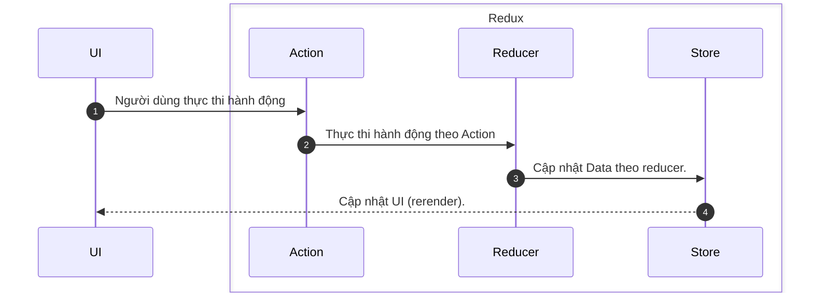

# Dữ liệu (Redux)

Quản lý dữ liệu, vòng đời dữ liệu.



## Cấu trúc

Cấu trúc dữ liệu trong dự án được tách ra theo từng đối tượng

```typescript
import thunk from "redux-thunk";
import AssetReducer from "../reducers/AssetReducer";
import AuthenticateReducer from "../reducers/AuthenticateReducer";
import ImageReducer from "../reducers/ImageReducer";
import NotificationReducer from "../reducers/NotificationReducer";
import ProductReducer from "../reducers/ProductReducer";
import SearchReducer from "../reducers/SearchReducer";
import TaskReducer from "../reducers/TaskReducer";
import SpaceReducer from "../reducers/SpaceReducer";
import ReportReducer2 from "../reducers/ReportReducer2";
import DepartmentReducer from "../reducers/DepartmentReducer";
import PartnerReducer from "../reducers/PartnerReducer";
import StatsReducer from "../reducers/StatsReducer";

const rootReducer = combineReducers({
  AuthenticateReducer,
  ImageReducer,
  AssetReducer,
  ProductReducer,
  TaskReducer,
  SearchReducer,
  NotificationReducer,
  SpaceReducer,
  ReportReducer2,
  DepartmentReducer,
  PartnerReducer,
  StatsReducer,
});
export const Store = createStore(rootReducer, applyMiddleware(thunk));
```

## Thực thi

```typescript ví dụ:
export default function AssetModal() {
  const assetReduxModelData: AssetReduxModel = useSelector(
    (state: any) => state.AssetReducer
  );
  const dispatch = useDispatch<any>();
  useEffect(() => {
    dispatch(PutAsset(assetReduxModelData.selectedAsset));
  });
}
```
