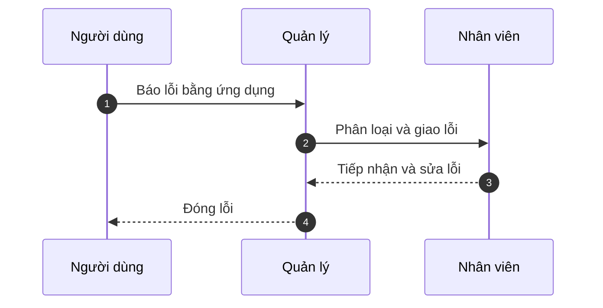
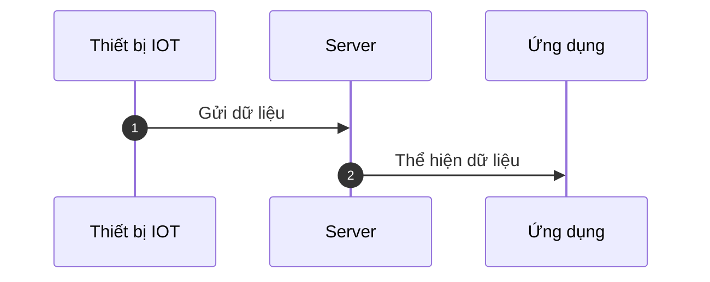

# ⚡️ Giới thiệu 1

Chào mừng đến với **Tài liệu FMez** - nguồn tài liệu duy nhất cho **FMEz**!.

FMEz là nền tảng quản lý, vận hành toà nhà, công trình bao gồm nhiều tính năng. Trong phạm vi tài liệu này đề cập tới các thông tin liên quan tới mã nguồn và kiến trúc của hệ thống.

Chúng ta sẽ đi qua concept chung và hướng dẫn cách tổ chức của **FMEz**.

#

## Dịch vụ

FMEz cung cấp dịch vụ phần mềm trong việc quản lý, vận hành và theo dõi toà nhà, công trình. Khách hàng sử dụng dịch vụ thông qua ứng dụng web và ứng dụng di động (ios và android).

## Tính năng

Các tính năng chính FMEz cung cấp cho người dùng bao gồm:

### Quản lý tài sản

Số hoá tài sản trong công trình, cho phép việc truy cập dễ dàng, nhanh chóng thông qua FMEz.
Thông qua ứng dụng di động có thể quét mã Qr để truy cứu hoặc tìm kiếm.

### Báo lỗi

Cho phép người dùng, chụp ảnh mô tả lỗi và gửi lên hệ thống. Cung cấp quy trình xử lý lỗi cho người dùng.
Quy trình xử lý lỗi như sau:

- Người dùng sử dụng ứng dụng di động báo lỗi
- Người có vai trò tiếp nhận và phân loại lỗi, sau đó giao lỗi cho nhân viên phụ trách.
- Nhân viên phụ trách tiếp nhận và sửa lỗi.
- Sau khi sửa lỗi gửi thông báo về cho quản lý.
- Quản lý kiểm tra lần cuối và đóng lỗi.

### Theo dõi năng lượng thông qua thiết bị IoT

FMEz cung cấp dịch vụ lắp đặt các thiết bị IoT để thu thập các dữ liệu về năng lượng như: điện, nước, gas, .... Sau đó sẽ gửi về hệ thống FMEz.
Qua đó có thể theo dõi, thống kê năng lượng sử dụng.

### Bảo trì

Người dùng sử dụng ứng dụng để giao việc, tạo lịch làm việc và giao việc cho đội ngũ nhân viên.

### Quản lý kho

Ứng dụng cung cấp quy trình nhập, xuất kho trong công trình.

### Quản lý chi phí

Quản lý chi phí phát sinh trong việc nhập kho hoặc sửa lỗi.

### Quản lý tài liệu

Người dùng có thể chia sẻ file trong tổ chức.

